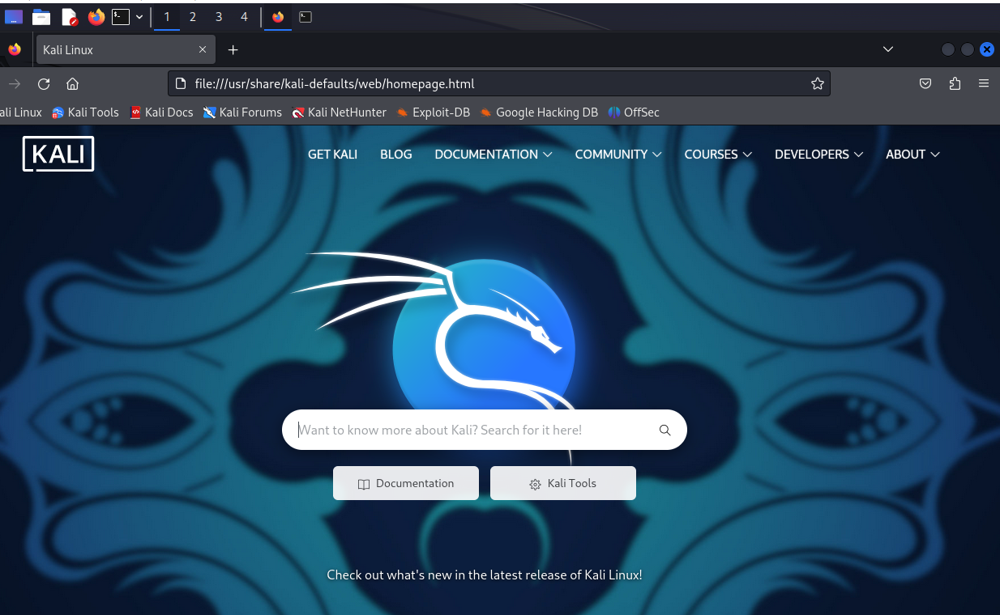
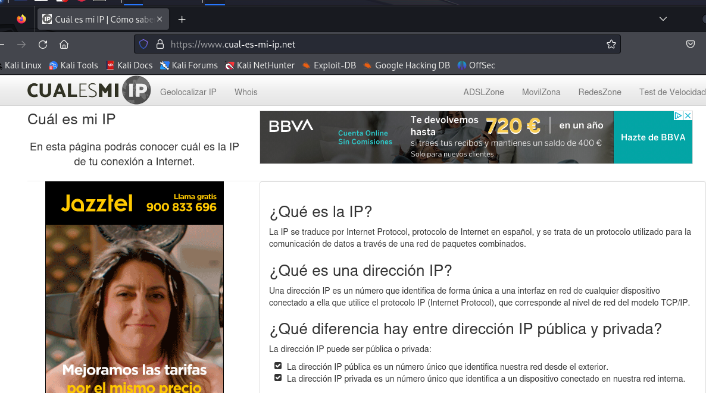

<p align="center">
<picture>
  <source media="(prefers-color-scheme: dark)" srcset="dark-web.png">
  <source media="(prefers-color-scheme: light)" srcset="dark-web.png">
  
</picture>
</p>

# :desktop_computer:	Red TOR 

<p align="center">
<picture>
  <source media="(prefers-color-scheme: dark)" srcset="tor.png">
  <source media="(prefers-color-scheme: light)" srcset="tor.png">
  
</picture>
</p>

> [!CAUTION]
> Laboratorios preparados para el entorno de la <b>red TOR</b> (Kali Linux 2023.4). Este laboratorio trata de realizar una redirección de todo el tráfico de red hacía la red TOR, o lo que es lo mismo, cualquier conexión del equipo que intente conectarse a Internet pasará por ella, evitando filtrar ping, forzando a las aplicaciones a derivar todo el tráfico por TOR (al contrario que ProxyChain, que es ignorado por algunas aplicaciones que tienden a una conexión más rápida ignorando los proxys). Asimismo, rechaza peticiones entrantes y salientes que puedan contener información sensible o pueda revelar la IP real y, por supuesto, realiza una protección de fuga de DNS, por lo que se puede utilizar un DNS remoto anónimo.

> TOR, sí... ¿Pero porqué?
The Onion Router... La conocida como <b>red TOR</b> es una de las mejores opciones a la hora de proteger la identidad en la red, dado que sus métodos de transferencia de datos están encriptados en varias capas, donde cada petición a un mismo servicio se envía por rutas diferentes utilizando múltiples nodos, lo que complica seguir una trazabilidad a un usuario o equipo dentro de una red. Su funcionamiento se basa en la red de servidores voluntarios.

> Ventajas de la utilización de la red TOR:
- Navegación Anónima: ocultación y cambio de IP ya que los nodos que TOR utiliza están encriptados bajo varias capas, además de tener una conexión de tipo HTTPS.
- Acceso a la Web Profunda (Deep Web): la parte de Internet que no está indexada por los motores de búsqueda convencionales y requiere acceso mediante direcciones URL específicas. 
- Acceso a la Dark Web: está oculta intencionalmente y requiere software especial para acceder a ella
- Privacidad en la Comunicación: TOR se utiliza a menudo para comunicaciones en línea privadas y seguras (correo electrónico y la mensajería instantánea, incluyendo WhatsApp y Telegram).
- Evitar la Censura en Internet: en aquellas regiones regiones del mundo donde (aún) existe una estricta censura en línea, ayudando a eludir filtros y restricciones impuestas por los gobiernos y otros actores. 
- Investigación y Periodismo: Los periodistas y activistas utilizan TOR para proteger su privacidad y seguridad mientras investigan temas sensibles o se comunican con fuentes anónimas.
- Protección contra la vigilancia: TOR encripta el tráfico de Internet y oculta la dirección IP del usuario, puede ayudar a proteger contra la vigilancia en línea realizada por gobiernos, proveedores de servicios de Internet y otros terceros.

> Deventajas de la utilización de la red TOR:
  - Bloqueo de scripts: algunos sitios web no funcionan, pueden cargar parcialmente o no cargar nada... Además, los mensajes de error no siempre aclaran las razones. En la mayor parte de los casos, el propio navegador de TOR bloquea ciertos scripts, donde se incluye muchos Javascript y scripts de seguimiento.
  - Lentitud: debido a que TOR rebota la conexión en diferentes nodos, este tipo de sistema hace que la conexión viaje más lejos y durante más tiempo de lo habitual ya que los nodos pueden estar muy lejos unos de otros. 
  - TOR es seguro, no invencible: como en la red indexada en los buscadores más conocidos, lo común y normal es que estén "pululando" diferentes tipos de malware, sitios falsos y miles de archivos de dudoso origen que podrían llegar a perjudicar gravemente a nuestros sistemas.
  - Contenido no deseado: Acceder a la Deep Web y a la Dark Web puede exponer a los usuarios a contenido peligroso o ilegal.

> El funcionamiento se basa en los siguientes elementos:

- <b>Tipo de comunicación</b>: la comunicación con la red Tor se establece mediante una ruta de comunicación más compleja que las conexiones normales a la hora de llegar al site al que se desea acceder, poniendo 3 nodos aleatorios de por medio.
- <b>Manejo de la comunicación</b>: la comunicación se maneja por capas, de modo que cada nodo solo tiene información de la capa inferior y superior a la propia, sin tener acceso a las capas de otros niveles (podrían ser el origen o el destino de la conexión), un tipo de arquitectura que dificulta que un monitoreo la conexión para poder llegar a identificar y localizar la conexión.
- <b>Tipos de servidores (nodos)</b>: En la red se dispone de <b>nodos de entrada</b>, el primer punto por donde pasa la información. Realmente, es el que conoce al IP del usuario que conecta a TOR, pero al utilizar el cifrado en varias capas, no se puede comprobar ni lo que se envía ni el destino final. A lo largo del viaje de los datos, estos pasan a través de <b>nodos intermedios</b>, puentes entre el nodo de entrada, otros nodos intermedios y el nodo de salida, donde no se obtiene ningún tipo de información sobre el usuario ni sobre el destino final de los datos. En el destino, el <b>nodo de salida</b> es el último punto en el proceso, el que realmente puede ver a qué destino se envían los datos, pero no sabe de dónde provienen... En conclusión los datos viajan cifrados mientras están en el circuito de la red Tor, así que ningún nodo puede saber la ruta completa de la conexión. 

<br>
<br>

#  Antes de todo... 

> [!IMPORTANT]
> Antes de navegar por la Deep Web o utilizar cualquier tipo de herramienta que necesite de una conexión con el exterior, es necesario seguir una serie de pasos imprescindibles para que el sistema esté completamente preparado para la realización correcta del laboratorio.

> ### Pre-requisitos 📋
Paso 1: Comprobación de la IP pública del nuestro propio sistema, para lo cual se utilizará el navegador de Kali Linux (Mozilla Firefox), donde se introducirá la URL: 
<b>
```
https://www.cual-es-mi-ip.net/
```
</b>

<p align="center">
<picture>
  <source media="(prefers-color-scheme: dark)" srcset="torghost_1.png">
  <source media="(prefers-color-scheme: light)" srcset="torghost_1.png">
  

  <source media="(prefers-color-scheme: dark)" srcset="torghost_2.png">
  <source media="(prefers-color-scheme: light)" srcset="torghost_2.png">
  
</picture>
</p>

<br>
<br>

#  Accede a los laboratorios  :floppy_disk:

- [LABORATORIO I](TorGhost): - Instalación y configuración del script de anonimización <b>TorGhost</b>