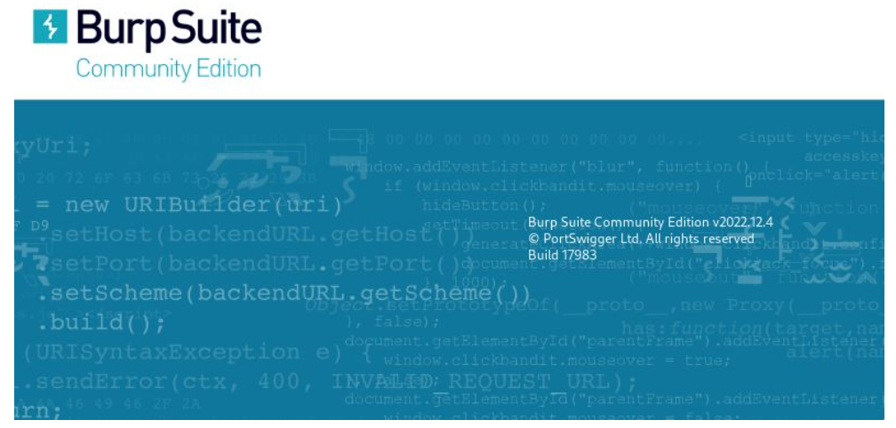

<p align="center">
<picture>
  <source media="(prefers-color-scheme: dark)" srcset="images/proxy.png">
  <source media="(prefers-color-scheme: light)" srcset="images/proxy.png">
  
</picture>
</p>

# :closed_lock_with_key:	Burp Suite Community Edition

<p align="center">
<picture>
  <source media="(prefers-color-scheme: dark)" srcset="images/burpsuite_1.png">
  <source media="(prefers-color-scheme: light)" srcset="images/burpsuite_1.png">
  
</picture>
</p>

> [!CAUTION]
> Laboratorios preparados para la realización de diversos ataques (Kali Linux 2023.4) mediante la utilización de la herramienta <b>Burp Suite</b>, una herramienta de seguridad de software creada con código abierto que se utiliza para hacer pruebas de pentesting y descubrir vulnerabilidades en aplicaciones web desarrollada por <b>PortSwigger Web Security</b> que incluye funciones de seguridad, además de una gran cantidad de recursos y documentación en línea para ayudar a comprender todas las propias funcionalidades de la herramienta.

## NO es una herramienta más...
> <b>Burp Suite</b> se ejecuta básicamente como proxy y se puede abrir directamente desde Kali Linux como una aplicación independiente en su versión <b>Community Edition</b> que, evidentemente, dispone de las opciones básicas de creación de proyectos temporales... Todo lo imprescindible en la versión gratuita de la plataforma, que está pre-instalada por defecto en el sistema operativo. Su función principal es la de actuar como <b>proxy HTTP</b> de la aplicación para hacer el pentesting.

> Un <b>proxy HTTP</b> es una herramienta usada en Hacking Ético y Pentesting con el fin de interceptar el tráfico de red, lo que permite analizar, modificar, aceptar o rechazar todas las solicitudes y respuestas de la aplicación.


<p align="center">
<picture>
  <source media="(prefers-color-scheme: dark)" srcset="images/burpsuite_0.png">
  <source media="(prefers-color-scheme: light)" srcset="images/burpsuite_0.png">
  
</picture>
</p>

# :desktop_computer:	Funcionamiento de BurpSuite Community Edition

> [!TIP]
> Laboratorios preparados para el aprendizaje de herramientas utilizando el software <b>Burp Suite</b> en su versión Community Edition. Se aprenderán técnicas y manejo de herramientas básicas para la realización de ataques típicos como:
> - SQLi 
> - Cross-Site Scripting (XSS) 
> - Denegación de servicio (DoS) 
> - Denegación de servicio Distribuída (DDoS) 
> - otros métodos de explotación de vulnerabilidades en aplicaciones web/servicio

> Gracias a este software podremos:
- Realizar de forma automatizada pruebas de exploración y escaneo de vulnerabilidades
- Escáner de vulnerabilidades avanzado para pruebas manuales
- Lógica de exploración de vanguardia
- Presentación detallada de vulnerabilidades, con recomendaciones y los payloads utilizados en cada una de las pruebas 
- Interceptación del tráfico del navegador mediante el Proxy (estilo <b>man-in-the-middle</b>)
- Ataques automatizados y personalizados (Burp Intruder)
- Uso de herramientas de prueba manuales avanzadas
- Utilización de diferentes métodos y técnicas de conexión a las aplicaciones Web

____________________________________________________________


> El funcionamiento se basa en los siguientes elementos:

- <b>Tipo de comunicación</b>: la comunicación con la red Tor se establece mediante una ruta de comunicación más compleja que las conexiones normales a la hora de llegar al site al que se desea acceder, poniendo 3 nodos aleatorios de por medio.
- <b>Manejo de la comunicación</b>: la comunicación se maneja por capas, de modo que cada nodo solo tiene información de la capa inferior y superior a la propia, sin tener acceso a las capas de otros niveles (podrían ser el origen o el destino de la conexión), un tipo de arquitectura que dificulta que un monitoreo la conexión para poder llegar a identificar y localizar la conexión.
- <b>Tipos de servidores (nodos)</b>: En la red se dispone de <b>nodos de entrada</b>, el primer punto por donde pasa la información. Realmente, es el que conoce al IP del usuario que conecta a TOR, pero al utilizar el cifrado en varias capas, no se puede comprobar ni lo que se envía ni el destino final. A lo largo del viaje de los datos, estos pasan a través de <b>nodos intermedios</b>, puentes entre el nodo de entrada, otros nodos intermedios y el nodo de salida, donde no se obtiene ningún tipo de información sobre el usuario ni sobre el destino final de los datos. En el destino, el <b>nodo de salida</b> es el último punto en el proceso, el que realmente puede ver a qué destino se envían los datos, pero no sabe de dónde provienen... En conclusión los datos viajan cifrados mientras están en el circuito de la red Tor, así que ningún nodo puede saber la ruta completa de la conexión. 

<br>
<br>

#  Antes de todo... 

> [!IMPORTANT]
> Antes de navegar por la Deep Web o utilizar cualquier tipo de herramienta que necesite de una conexión con el exterior, es necesario seguir una serie de pasos imprescindibles para que el sistema esté completamente preparado para la realización correcta del laboratorio.

> ### Pre-requisitos 📋 
Paso 1: Comprobación de la IP pública del nuestro propio sistema, para lo cual se utilizará el navegador de Kali Linux (Mozilla Firefox), donde se introducirá la URL: 
<b>
```
https://www.cual-es-mi-ip.net/
```
</b>

<p align="center">
<picture>
  <source media="(prefers-color-scheme: dark)" srcset="images/torghost_1.png">
  <source media="(prefers-color-scheme: light)" srcset="images/torghost_1.png">
  
</picture>
<picture>
  <source media="(prefers-color-scheme: dark)" srcset="images/torghost_2.png">
  <source media="(prefers-color-scheme: light)" srcset="images/torghost_2.png">
  
</picture>
</p>

<br>
<br>

#  Accede a los laboratorios  :floppy_disk:

- [LABORATORIO I](TorGhost): - Instalación y configuración del script de anonimización <b>TorGhost</b>