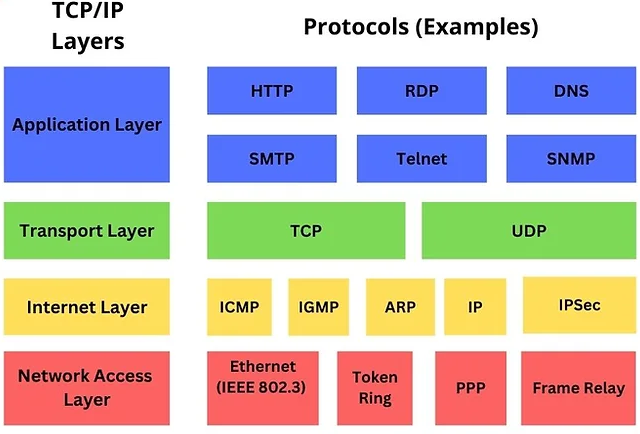
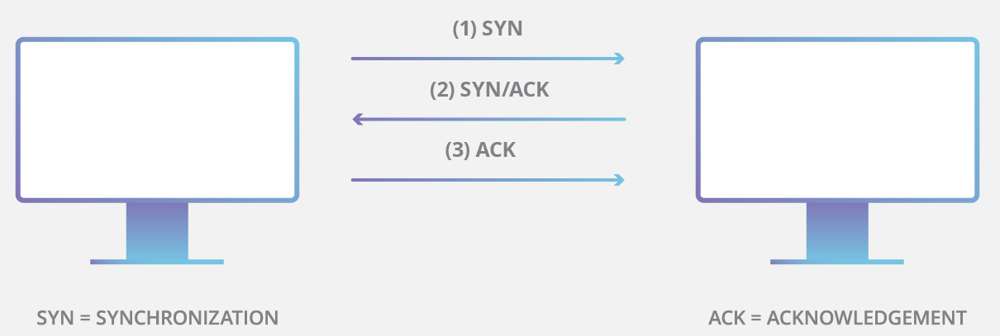

# 	Ataque DoS (Denial Of Service) utilizando SYNFlood

> [!IMPORTANT]
> Laboratorio SynFlood en <b>framework Metasploit</b> (Kali Linux 2023.4). Un ataque DoS o DDoS no es más que el envío de un número exageradamente elevado de peticiones a una dirección IP que, normalmente, suele ser un servidor o infraestructura, el cual llega a ser incapaz de gestionar dicho número de peticiones, causando un error o crasheo del sistema y la detención y/o reinicio de servicios, quedando inaccesible al resto de usuarios. 

> Ahora bien, la diferencia entre un ataque <b>DoS (Denial of Service o Denegación de Servicio)</b> y un <b>ataque DDoS ( Distributed Denial of Service o Denegación de Servicio Distribuido)</b> es muy sencilla ya que en el ataque DoS, el atacante cuenta con un único equipo, mientras que para el ataque DDoS se usan múltiples máquinas simultáneamente. Estas máquinas suelen pertenecer a <b>botnets</b> (redes de equipos/servidores controlados por un único atacante).


> ### Primeros conceptos: MODELO TCP/IP :computer:
> Como primer concepto, se ha de conocer el <b>modelo TCP/IP</b>, protocolo de red que permite la comunicación a través de Internet (abreviatura de <b>Protocolo de control de transmisión/Protocolo de Internet</b>), el cual es un protocolo estándar y un modelo (en la actualidad) de 4 capas que define cómo se transmiten los datos a través de una red y cómo se comunican los dispositivos. Su origen se da en la década de 1970 gracias al Departamento de Defensa de USA (DOD), ya que se pretendía crear una red que pudiera funcionar incluso si partes de ella resultaran dañadas o destruidas. Posteriormente, el modelo TCP/IP se publicó por primera vez en 1981 (versión 4) y luego se actualizó a la versión 6 en 1995. 

<p align="center">
<picture>
  <source media="(prefers-color-scheme: dark)" srcset="images/TCPSyn_1.png">
  <source media="(prefers-color-scheme: light)" srcset="images/TCPSyn_1.png">
  
</picture>
</p>


> Veamos todas las capas TCP/IP: 

> <b>1.- Capa de aplicación</b>: es la capa más alta del modelo TCP/IP, un marco que define cómo se comunican los dispositivos a través de una red, es decir, es la capa más cercana al usuario final y representa las aplicaciones que se ejecutan en el dispositivo y utilizan la red para comunicarse y cuya función principal es proporcionar un medio para que las aplicaciones accedan a la red y se comuniquen con otros dispositivos. Así, se presentan un conjunto de protocolos que permiten a las distintas aplicaciones enviar y recibir datos a través de la red, como por ejemplo los protocolos <b>HTTP (Protocolo de transferencia de hipertexto)</b>, <b>SMTP (Protocolo Simple de Transferencia de Correo)</b>, <b>DNS (Sistema de Nombres de Dominio)</b>, <b>RDP (Protocolo de Escritorio Remoto)</b>, <b>SNMP (Protocolo simple de gestión de red)</b>, <b>FTP (Protocolo de Transferencia de Archivos)</b> o <b>HTTPS (Protocolo Seguro de Transferencia de Hipertexto)</b>

> <b>2.- Capa de transporte</b>: define cómo se comunican los dispositivos a través de una red, por lo que se sitúa por encima de la capa de Internet y de la capa de aplicación, lo que le brinda una función principal que garantiza la entrega fiable de datos entre los dispositivos de una red, es decir, es responsable de establecer y mantener la comunicación de extremo a extremo entre dispositivos y de proporcionar comprobación de errores y control de flujo. Para ello, utiliza dos protocolos principales para lograr estos objetivos, como son <b>TCP (Protocolo de Control de Transmisión)</b> como protocolo orientado a la conexión que proporciona una entrega de datos fiable y <b>UDP (Protocolo de Datagramas de Usuario)</b> como protocolo sin conexión que no garantiza la entrega de datos. Además, esta capa ofrece servicios como la numeración de puertos, lo cual permite que varias aplicaciones de un mismo dispositivo se comuniquen simultáneamente a través de la red, proporcionando además multiplexación y demultiplexación para la transmisión de múltiples flujos de datos a través de una única conexión.

> <b>3.- Capa de Internet</b>: se encarga de proporcionar servicios lógicos de direccionamiento y encaminamiento para garantizar que los paquetes de datos se entregan desde su origen hasta su destino a través de una red, es decir,m proporciona los medios para que dos dispositivos se comuniquen entre sí independientemente de su ubicación física o del tipo de red a la que estén conectados. Algunos ejemplos de protocolos de capa de Internet son, por ejemplo, el <b>Protocolo de Internet (IP)</b> , <b>Protocolo de Mensajes de Control de Internet (ICMP)</b>, <b>Protocolo de Gestión de Grupos de Internet (IGMP)</b>, <b>Protocolo de resolución de direcciones (ARP)</b>, <b>Protocolo de Resolución Inversa de Direcciones (RARP)</b> y el <b>Protocolo de Internet versión 6 (IPv6)</b>.

> <b>4.- Capa de acceso a la red</b>: también conocida como <b>capa de enlace<b>, es responsable (junto con las anteriores capas) de la transmisión de datos entre dispositivos de una red local, es decir, se encarga de transmitir datos entre dispositivos conectados físicamente a la misma red y utiliza protocolos como Ethernet y Token ring. Esta capa se encarga de añadir una cabecera a cada paquete de datos que contiene información como la <b>dirección MAC (Media Access Control)</b> de destino y el número de secuencia del paquete (recordemos que la dirección MAC es un identificador numérico único asignado a cada dispositivo conectado a la red). Ejemplos de protocolos de esta capa pueden ser <b>Token Ring (IEEE 802.5)</b>, <b>PPP (Protocolo Punto a Punto)</b> y <b>Frame Relay</b>.

> Sabiendo esto, estamos en disposición de comenzar a realizar un ataque de <b>inundación TCP SYN</b>, muy efectivo si realizamos Dos o DDoS. Realmente, este tipo de ataque realiza un bombardeo masivo de peticiones de conexión al servidor objetivo (mediante paquetes SYN), siempre sin responder a los acuses de recibo de transmisión que se lanzan por parte del server (los que serían paquetes ACK SYN). Evidentemente, al no terminar la negociación, se consumen los recursos del servidor para básicamente desplazar el tráfico legítimo, haciendo imposible abrir nuevas conexiones legítimas y dificultando o imposibilitando el funcionamiento correcto del servidor para los usuarios autorizados que ya están conectados.

<p align="center">
<picture>
  <source media="(prefers-color-scheme: dark)" srcset="images/TCPSyn_2.png">
  <source media="(prefers-color-scheme: light)" srcset="images/TCPSyn_2.png">
  
</picture>
</p>

> Existen varios tipo de ataque:
- <b>Ataque directo</b>: en este caso, el atacante no oculta su dirección IP. Dado que para crear el ataque utiliza un único dispositivo de origen con una dirección IP real, el atacante es altamente vulnerable a ser descubierto y a las mitigaciones (blacklist y otros bloqueos). 
- <b>Ataque con suplantación</b>: el atacante puede falsificar la dirección IP en cada paquete SYN que dr envíe para obstaculizar los esfuerzos de mitigación y dificultar que se descubra su identidad... Los paquetes pueden ser falsificados, aunque estos podrían llegar a rastrearse hasta su origen. 
- <b>Ataque distribuido (DDoS)</b>: si un ataque se crea usando una <b>red de bots (botnet)</b>, es muy difícil rastrear el ataque hasta su origen ya que, por añadidura, el atacante puede hacer que cada dispositivo distribuido también falsifique las direcciones IP desde las que envía los paquetes. 


- <b>Paso 1</b>: Ya dentro de Metasploit Framework, se utilizará el exploit multi handler, payload que se utiliza para conectar con el objetivo. Dependiendo del tipo de payload, el handler queda a la espera (está en modo escucha) de una conexión por parte del payload cargado en el objetivo (reverse payload), llegando a iniciar una conexión contra el host y puertos objetivo en ciertos casos (bind payload). En la consola, se codifica:
<b>

```
use exploit/multi/handler
```
</b>

