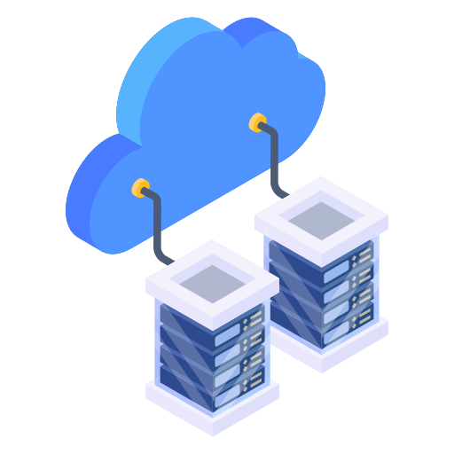
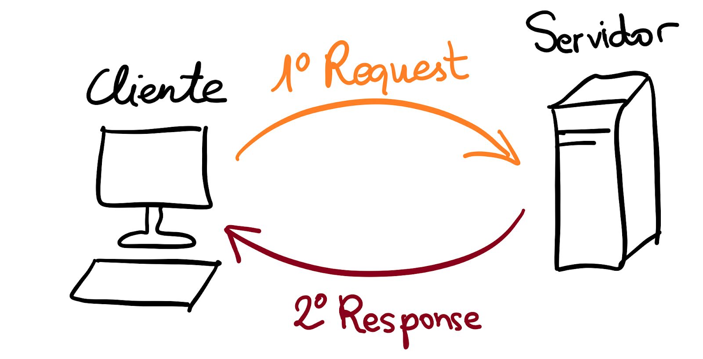
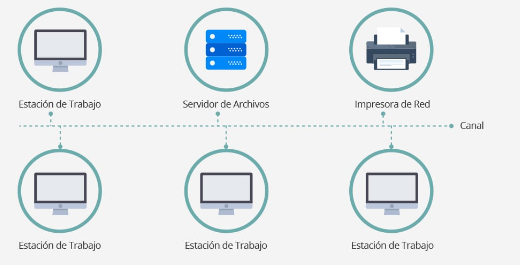
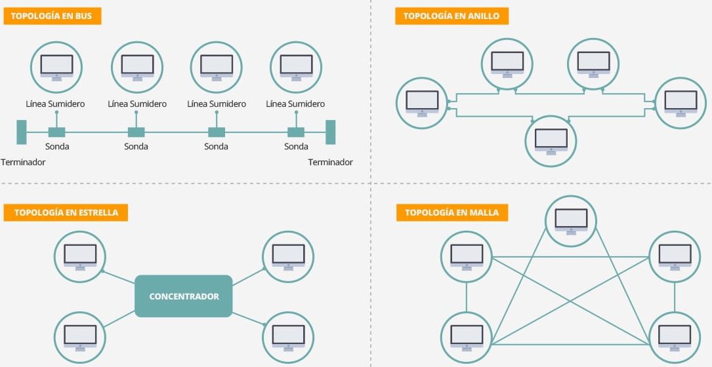
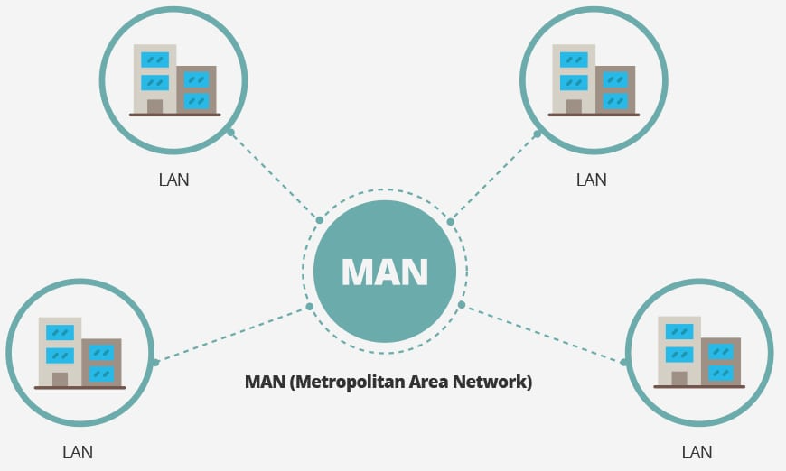
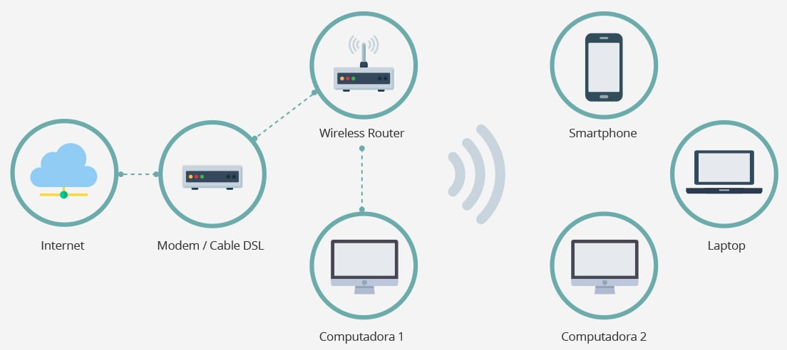
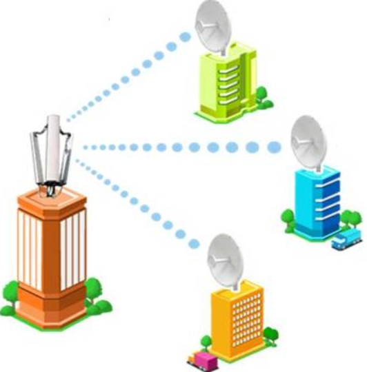
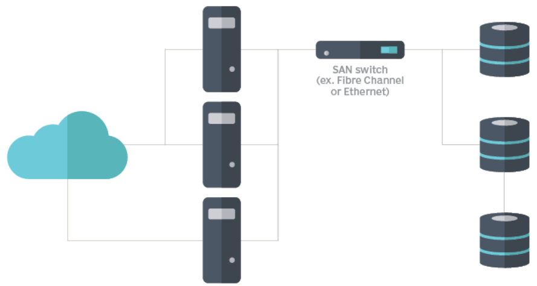
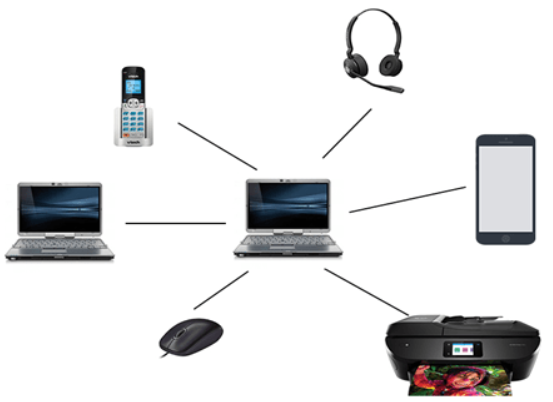

# 	Conceptos básicos sobre Redes y Protocolos 

> [!IMPORTANT]
> Las redes de computadoras son un componente fundamental en el mundo moderno de las TICs ya que nos permiten la comunicación y el intercambio de datos entre dispositivos (PCs, smartphones, tablets y otros dispositivos) conectados a Internet. Si bien es cierto que existen diferentes tipos de redes, cada una con sus propias características y aplicaciones.

En la actualiddad, utilizamos la <b>arquitectura cliente-servidor</b>, donde la red de comunicaciones está dispuesta de manera que todos los clientes están conectados a un servidor en el que se centralizan los recursos y aplicaciones con que se cuenta, los cuales pone a disposición de los clientes cada vez que estos son solicitados. Esto, realmente, significa que todas las gestiones que se realizan se concentran en el servidor, de manera que en él se disponen los requerimientos provenientes de los clientes que tienen prioridad, los archivos que son de uso público y los que son de uso restringido... La principal característica es que en este tipo de redes los roles están bien definidos y no se intercambian, es decir, los clientes en ningún momento pueden tener el rol de servidores y viceversa, manteniendo un control centralizado de la información, aportando con esto mayor seguridad y mayor rendimiento a menores costes. 

<p align="center">
<picture>
  <source media="(prefers-color-scheme: dark)" srcset="images/redes_0.png">
  <source media="(prefers-color-scheme: light)" srcset="images/redes_0.png">
  
</picture>
</p>

Ahora bien, las redes podríamos clasificarlas según su localización y magnitud:

 - <b>Redes de área local (LAN)</b>: redes que conectan dispositivos en un área geográfica limitada (oficina, edificio o campus universitario), siendo de propiedad privada y utilizando tecnologías como Ethernet para la transmisión de datos. La velocidad de transmisión debe ser relativamente elevada, debe ser privada, es decir, perteneciente a una misma organización y con una tasa de error debe ser muy baja. 

<p align="center">
<picture>
  <source media="(prefers-color-scheme: dark)" srcset="images/redes_1.png">
  <source media="(prefers-color-scheme: light)" srcset="images/redes_1.png">
  
</picture>
</p>

El rango IP es de clase C, cuyas topologías, dependiendo de la forma física como se interconectan las computadoras y las redes informáticas entre sí suelen ser de tipo Bus (un solo cable principal al que todos los terminales están conectados), Anillo (donde los nodos se conectan uno a otro, el último cierra el anillo conectándose con el primero), Estrella (aquí los nodos se conectan a un nodo central de modo que, si falla un nodo no se interrumpe el flujo de información, aunque si falla un nodo central las transmisiones se interrumpen) y la topología de Malla (donde cada nodo tiene conexión directa con los demás nodos).

<p align="center">
<picture>
  <source media="(prefers-color-scheme: dark)" srcset="images/redes_2.png">
  <source media="(prefers-color-scheme: light)" srcset="images/redes_2.png">
  
</picture>
</p>

- <b>Redes de área metropolitana (MAN)</b>: consiste en computadoras compartiendo recursos entre sí en áreas de cobertura de mayor tamaño que una LAN, pero menor que una WAN. En realidad, funcionan de forma muy parecida a una LAN, pero cumpliendo estándares tecnológicos diferentes y subsanando los problemas de latencia (retardo en la entrega de información) y pérdida de calidad de la señal en interconexiones que abarcan largas distancias. Su rango IP abarca la clase B (de forma común)

<p align="center">
<picture>
  <source media="(prefers-color-scheme: dark)" srcset="images/redes_4.png">
  <source media="(prefers-color-scheme: light)" srcset="images/redes_4.png">
  
</picture>
</p>

En general se utiliza un bus doble (ida y vuelta de fibra óptica) para interconectar las diferentes LAN a la red, aunque también se consiguen redes MAN usando pares de cobre o microondas, ofreciendo estabilidad y menor latencia para portar servicios multimedia y videovigilancia en grandes ciudades, entre otras ventajas. Como el resto de las redes cableadas, tiene su versión inalámbrica llamada <b>WMAN (Wireless Metropolitan Area Network)</b>, aunque este tipo de red utiliza tecnologías de telefonía celular (LTE y WiMax) para interconectar sus miembros.

- <b>Redes de área extensa (WAN)</b>: Son redes que conectan dispositivos en áreas geográficas más amplias (ciudades, países o continentes), donde se suelen utilizar infraestructuras de telecomunicaciones públicas (líneas telefónicas o cables submarinos) y tecnologías como el Protocolo de Internet (IP) para la transmisión de datos, aunque la capacidad de transmisión suele ser menor que las de las redes locales ya que las líneas son compartidas por muchos usuarios, siendo mucho menos seguras que sus versiones conectadas físicamente. Para evitar problemas de rendimiento pueden interconectarse varias LAN entre sí, sin importar la distancia.

<p align="center">
<picture>
  <source media="(prefers-color-scheme: dark)" srcset="images/redes_3.png">
  <source media="(prefers-color-scheme: light)" srcset="images/redes_3.png">
  
</picture>
</p>

El rango IP es de clase A, dada su magnitud y el territorio que han de cubrir, superando los 100km.

- <b>Redes inalámbricas locales (WLAN)</b>: Estas redes utilizan ondas de radio en lugar de cables para la comunicación entre dispositivos. Son especialmente útiles en entornos donde la instalación de cables es difícil o poco práctica (hogar, cafeterías, aeropuertos y centros comerciales), aunque es cierto que suelen tener muchos problemas con las zonas de cobertura ya que los elementos constructivos suelen hacer de escudo ante la señal WiFi. La conexión se realiza en 3 fases (exploración, auntenticación y asociación), utilizando un proceso de transmisión en el que se utiliza la <b>capa física (PHY)</b> para convertir la información en ondas de radio, gestionando los datos para que puedan ser transmitidos a través de radiofrecuencia, la <b>subcapa MAC (Control de Acceso al Medio)</b> para coordinar y regular la distribución de red y así evitar la transmisión simultánea y la recepción, donde la información se convierte nuevamente en información comprensible para el dispositivo receptor.

<p align="center">
<picture>
  <source media="(prefers-color-scheme: dark)" srcset="images/redes_6.png">
  <source media="(prefers-color-scheme: light)" srcset="images/redes_6.png">
  
</picture>
</p>

- <b>Red Inalámbrica de Area Amplia (WMAN)</b>: es la versión inalámbrica de MAN, la cual puede llegar a tener un rango de alcance de decenas de kilómetros ya que está basada en el estándar de comunicaciones <b>WiMAX (Worldwide Interoperability for Microwave Access)</b>, UMTS, GPRS, EDGE, CDMA2000, GSM, CDPD, Mobitex, HSPA y 3G para realizar la transferencia de los datos entre los nodos que componen la red, logrando cobertura inalámbrica a un área geográfica relativamente grande. 

<p align="center">
<picture>
  <source media="(prefers-color-scheme: dark)" srcset="images/redes_7.png">
  <source media="(prefers-color-scheme: light)" srcset="images/redes_7.png">
  
</picture>
</p>

- <b>Red de Area de Almacenamiento (Storage Area Network)</b>: realmente es una tecnología muy usada por grandes corporaciones para mayor flexibilidad en la obtención y manipulación de datos que necesita para el desarrollo normal del su negocio. Así, una SAN es una red compuesta por unidades de almacenamiento que se conectan a las redes de área local de las compañías, capaces de crecer de forma ilimitada. En redes de área de almacenamiento típicas, los servidores se conectan a través de <b>adaptadores de bus de host (HBA)</b> o <b>controladores de interfaz de red (NIC)</b> especializados.Una vez que los dispositivos de almacenamiento están conectados a la red SAN, se pueden configurar para formar grupos de almacenamiento lógico conocidos como <b>volúmenes lógicos</b>. La arquitectura se basa en centralizción, donde los dispositivos de almacenamiento están conectados a un sistema centralizado, lo que permite mayor eficiencia en la gestión de los recursos de almacenamiento, incluyendo que se separa la LAN de la red dedicada a la transferencia de datos de almacenamiento para evitar problemas de congestión. Si sumamos, además, la utilización de protocolos especializados (<b>Fibre Channel</b> e <b>iSCSI</b>), para la transferencia de datos, proporciona una mayor velocidad y eficiencia que los protocolos utilizados en la LAN. Por otro lado, se utilizan herramientas que permiten la monitorización, la configuración y el mantenimiento de la red y sus componentes, lo que mejora la eficiencia de la red y simplifica los procesos de gestión, así como la utilización de medidas de seguridad avanzadas, como la autenticación y el cifrado de datos entre otras.

<p align="center">
<picture>
  <source media="(prefers-color-scheme: dark)" srcset="images/redes_8.png">
  <source media="(prefers-color-scheme: light)" srcset="images/redes_8.png">
  
</picture>
</p>

- <b>Redes de área personal (PAN)</b>: Son redes diseñadas para la comunicación entre dispositivos personales cercanos (smartphones, tablets, smartTVs, portátiles), utilizando tecnologías como <b>Bluetooth</b>, infrarrojos y <b>Near Field Communication (NFC)</b> para intercambiar información entre los mismos.

<p align="center">
<picture>
  <source media="(prefers-color-scheme: dark)" srcset="images/redes_9.png">
  <source media="(prefers-color-scheme: light)" srcset="images/redes_9.png">
  
</picture>
</p>


----------------


VLAN (Virtual Local Area Network): Funciona como una VPN dentro de una red local. Permite la creación de una conexión privada entre dos o más nodos dentro del universo de una LAN. Ideal, por ejemplo, para separar el acceso a la red de diferentes departamentos de una empresa. Son creadas vía software, por lo que sus nodos no necesitan estar interconectados directamente entre sí.

SAN (Storage Area Network): Las redes de área de almacenamiento (SAN) son una tecnología usada para enlazar unidades de almacenamiento (básicamente discos duros) a una red local, de manera de compartir su uso en todas las áreas de una empresa. Este sistema puede crecer casi ilimitadamente sin afectar el rendimiento de la red ya que el tráfico de almacenamiento se mantiene separado del tráfico de los usuarios.


> ### Funcionamiento de este ataque :globe_with_meridians:
> Veamos un esquema de conexión real:


> De entre todos los ataques que utilizan la saturación de sistema, SYN flood sigue un patrón de ataque que constituye un abuso del TCP Threeway Handshake.

<p align="center">
<picture>
  <source media="(prefers-color-scheme: dark)" srcset="images/SYNFlood_DDoS_2.png">
  <source media="(prefers-color-scheme: light)" srcset="images/SYNFlood_DDoS_2.png">
  
</picture>
</p>

> Así, como hemos comentado anteriormente, el cliente (atacante) envía un paquete de sincronización (SYN) al servidor, el cual, al recibir este paquete, responde con un paquete de sincronización (SYN) y una confirmación (ACK). La conexión concluye con el acuse de recibo (ACK) por parte del cliente pero, en caso de que esta no se produzca, los sistemas se pueden paralizar, ya que el servidor no cuenta en su memoria con suficientes conexiones confirmadas. 


> ### ¿Cómo detectar un ataque de inundación SYN? :shield:
> La detección como tal puede llegar a ser muy dificil debido a que no se puede distinguir de los picos de tráfico legítimo, y más cuando el posible atacante está enmascarando y ocultando su IP real o si utiliza puertos aleatorios de origen. Así, se pueden utilizar múltiples técnicas que permiten identificar este tipo de ataques:

> - <b>Monitoreo del tráfico de red en busca de actividad sospechosa</b>:Se podrían utilizar herramientas de captura y análisis de paquetes de red (Paessler PRTG Network Monitor, ManageEngine Netflow Analyzer, Scrutinizer, NetflowAuditor, nTop, Pandora NTA, Wireshark, sflowtool, Nfsen, Intermapper Flows, FlowViewer o ManageEngine Flow Analyzer)para inspeccionar el tráfico entrante y saliente del server en búsqued de anomalías como pueden ser niveles inusualmente altos de tráfico, tráfico proveniente de ubicaciones o fuentes poco comunes o un gran número de paquetes SYN sin paquetes ACK correspondientes. 

> - <b>Verificar el estado de los recursos del server</b>: Se podrían utilizar comandos como <b>netstat</b>, <b>ss</b> o <b>iptraf</b> para verificar el estado de las conexiones TCP y comprobar si hay muchas conexiones tipo <b>SYN_RECV</b> o solicitudes de conexión <b>SYN_SENT</b> que no se completan.  Así, se podría utilizar alguno de los siguientes comandos en el shell: 
<b>

```
# mostrar las conexiones TCP en estado <b>SYN_RECV</b>
netstat -ant | grep SYN_RECV
```
</b>

<b>

```
# muestra de estadísticas: 
# - número de aperturas TCP activas
# - aperturas TCP pasivas - paquetes SYN recibidos, 
# - intentos de conexión fallidos de los paquetes SYN-ACK enviados, pero no ACK recibidos 
# - conexiones reiniciadas por los paquetes RST enviados o recibidos 

netstat -s
```
</b>

> - <b>Comprobación de uso de CPU</b>: donde se podría comprobar parámetros como el consumo de memoria, ancho de banda de la red del servidor y otros tantos. 

> - <b>Utilizar SYN COOKIES u otros mecanismos de protección contra inundaciones SYN</b>: Las <b>SYN COOKIES</b> son una técnica que permite al servidor manejar paquetes SYN sin asignar recursos hasta que se reciba el paquete ACK final de manera que, como podríamos comprobar, el servidor puede evitar mantener conexiones medio abiertas y desperdiciar recursos. Para su activación, se pueden utilizar los siguientes comandos en el sistema operativo Linux:
<b>

```
# activar las syn cookies 
sysctl -w net.ipv4.tcp_syncookies="1"
```
</b>

<b>

```
# aumentar el 'backlog queue' 
sysctl -w net.ipv4.tcp_max_syn_backlog="2048"
```
</b>

<b>

```
# minimizar el tiempo de espera en la respuesta al SYN+ACK
sysctl -w net.ipv4.tcp_synack_retries=2
```
</b>

En el caso de Windows: 

<b>

```
# activar la prote4cción anti SYNFlood
C:\>reg add HKLM\SYSTEM\CurrentControlSet\Services\Tcpip\Parameters /v SynAttackProtect /t REG_DWORD /d 1
```
</b>

<b>

```
# aumentar el 'backlog queue' 
C:\>reg add HKLM\System\CurrentControlSet\Services\AFD\Parameters /v EnableDynamicBacklog /t REG_DWORD /d 1

C:\>reg add HKLM\System\CurrentControlSet\Services\AFD\Parameters /v MinimumDynamicBacklog /t REG_DWORD /d 20

C:\>reg add HKLM\System\CurrentControlSet\Services\AFD\Parameters /v MaximumDynamicBacklog /t REG_DWORD /d 20000

C:\>reg add HKLM\System\CurrentControlSet\Services\AFD\Parameters /v DynamicBacklogGrowthDelta /t REG_DWORD /d 10
```
</b>

<b>

```
# minimizar el tiempo de conexión half-open
C:\>reg add HKLM\SYSTEM\CurrentControlSet\Services\Tcpip\Parameters /v TcpMaxConnectResponseRetransmissions /t REG_DWORD /d 2
```
</b>


> - <b>Otros mecanismos de protección</b>: Se incluyen firewalls, balanceadores de carga, proxies o servicios de mitigación de DDoS que pueden filtrar el tráfico malicioso y bloquear paquetes SYN provenientes de direcciones IP enmascaradas.

> - <b>Limitación de velocidad</b>: Consiste en limitar el número de peticiones SYN que pueden enviarse a su servidor en un momento dado, lo que evita en gran medida que el server se vea desbordado, preservando algunos recursos para el tráfico legítimo.

> - <b>Firewall de Aplicaciones Web de Nueva Generación (NGWAF)</b>: <b>NGWAF</b> es un dispositivo o servicio que puede proteger las aplicaciones web de varios tipos de ciberataques, incluidos los ataques SYN Flood ya que se encarga de analizar y filtrar el tráfico entrante en la capa de aplicación y bloquear las peticiones maliciosas antes de que lleguen al servidor. 

> - <b>Segmentación de red</b>: Esta técnica consiste en dividir su red en subredes más pequeñas y seguras para limitar el daño potencial de un ataque de inundación SYN, de manera que se aislan los servidores o aplicaciones críticas del resto de la red, aunque se deben proteger con medidas de seguridad adicionales.

> - <b>Equilibrio de la carga</b>: Consiste en distribuir el tráfico entrante entre varios servidores, reduciendo así el riesgo de que un solo servidor se vea sobrecargado por un ataque de inundación SYN gracias a dispositivos o servicios de balanceo de carga que pueden equilibrar la carga entre los servidores y redirigir el tráfico lejos de los afectados.

> - <b>Aumentar la cola de registros</b>: Conocida como <b>backlog máximo</b>, lo que puede garantizar espacio para el tráfico de usuarios legítimos en medio de un ataque.

> - <b>Reciclaje de la conexión TCP</b>: Que pretende sobrescribir la conexión medio abierta más antigua una vez se haya completado el backlog, con el fin de establecer conexiones con usuarios legítimos en un tiempo menor del que necesitaría el backlog para llenarse de paquetes SYN.

<p align="center">
<picture>
  <source media="(prefers-color-scheme: dark)" srcset="images/SYNFlood_DDoS_3.png">
  <source media="(prefers-color-scheme: light)" srcset="images/SYNFlood_DDoS_3.png">
  
</picture>
</p>

> - <b>Mantener el sistema actualizado y parcheado</b>: Es obligatorio mantener el sistema operativo, software de servidor, aplicaciones y herramientas de seguridad actualizados y parcheados con las últimas versiones y correcciones. 

> - <b>Utilizar autenticación y cifrado seguros</b>: Se deben utilizar métodos de autenticación y cifrado fuertes para proteger el server y sitio web de accesos no autorizados o manipulaciones (usar HTTPS en lugar de HTTP, certificados SSL/TLS en lugar de certificados autofirmados y autenticación de dos factores en lugar de contraseñas).

> - <b>Aplicar políticas y normas de seguridad de la red</b>: Se deben implementar políticas y reglas de seguridad de red que ayuden a controlar y supervisar el tráfico que entrante y saliente del server y sitio web, como por ejemplo utilizar cortafuegos, enrutadores o conmutadores para filtrar el tráfico no deseado o malicioso o, incluso, utilizar dispositivos o servicios IDS o IPS para detectar y bloquear posibles ataques de inundación SYN u otros tipos de ciberataques.

<p align="center">
<picture>
  <source media="(prefers-color-scheme: dark)" srcset="images/SYNFlood_DDoS_4.png">
  <source media="(prefers-color-scheme: light)" srcset="images/SYNFlood_DDoS_4.png">
  
</picture>
</p>