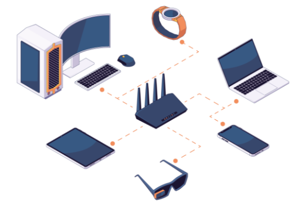

# 	Conceptos básicos sobre Redes y Protocolos 

> [!IMPORTANT]
> Las redes de computadoras son un componente fundamental en el mundo moderno de las TICs ya que nos permiten la comunicación y el intercambio de datos entre dispositivos (PCs, smartphones, tablets y otros dispositivos) conectados a Internet. Si bien es cierto que existen diferentes tipos de redes, cada una con sus propias características y aplicaciones.

# :closed_lock:	Modelos OSI y TCP/IP en protocolos de red: Cómo funcionan las redes

> Pero como en todo,, lo primero que debemos ver es el concepto fundamental: <b>¿Qué es un protocolo de red?</b> Como tal, realmente es un estándar de comunicaciones que contiene las reglas e información necesaria de cómo las computadoras intercambian datos entre sí, por lo que podemos resumir en que cada uno de los protocolos de comunicación de redes asume entonces una tarea específica en el medio que se requiera, el cual puede abarcar múltiples sectores, siendo desarrollados por entidades, organizaciones y personas que trabajan en la industria, institutos de investigación, y muchas entidades más que, posteriormente, publican y aceptan en conferencias internacionales para marcar estándares de comunicaciones, como en el caso de la <b>ISO (International Standars Organization)</b>, por medio de la <b>arquitectura OSI (Open Systems Interconnect)</b>, dos de las más importantes. De manera general, los protocolos de red llevan a cabo las siguientes tareas:

- Establecer una conexión confiable entre los equipos implicados en la comunicación
- Dirigir los paquetes de datos enviados al destinatario correcto
- Si los paquetes no llegan, el protocolo se asegura de que se reenvíen
- Transmisión sin errores de los paquetes de información
- Organización y fusión de los paquetes de datos entrantes
- Cifrado de los datos transmitidos para que no puedan ser leídos por terceros (encriptación)

> Así, podemos decir que los protocolos de red se definen como <b>lineamientos</b>, <b>normas</b> o <b>reglas</b> bien definidas mediante las cuales un usuario se comunica a través de Internet o Intranet, por lo que existen diversos tipos como el <b>IP</b> o <b>Protocolo de Internet</b>, los protocolos de red como <b>IMAP (Protocolo de acceso a mensajes de Internet)</b>, <b>SMTP (Protocolo simple de transferencia de correo)</b> y POP3 (Protocolo de oficina de correos, emails entrantes), entre los más conocidos. 

> En la actualidad, utilizamos la <b>arquitectura cliente-servidor</b>, donde la red de comunicaciones está dispuesta de manera que todos los clientes están conectados a un servidor en el que se centralizan los recursos y aplicaciones con que se cuenta, los cuales pone a disposición de los clientes cada vez que estos son solicitados. Esto, realmente, significa que todas las gestiones que se realizan se concentran en el servidor, de manera que en él se disponen los requerimientos provenientes de los clientes que tienen prioridad, los archivos que son de uso público y los que son de uso restringido... La principal característica es que en este tipo de redes los roles están bien definidos y no se intercambian, es decir, los clientes en ningún momento pueden tener el rol de servidores y viceversa, manteniendo un control centralizado de la información, aportando con esto mayor seguridad y mayor rendimiento a menores costes. 

<picture>
  <source media="(prefers-color-scheme: dark)" srcset="images/redes_0.png">
  <source media="(prefers-color-scheme: light)" srcset="images/redes_0.png">
  
</picture>

> Ahora bien, las redes podríamos clasificarlas según su localización y magnitud:

 - <b>Redes de área local (LAN)</b>: redes que conectan dispositivos en un área geográfica limitada (oficina, edificio o campus universitario), siendo de propiedad privada y utilizando tecnologías como Ethernet para la transmisión de datos. La velocidad de transmisión debe ser relativamente elevada, debe ser privada, es decir, perteneciente a una misma organización y con una tasa de error debe ser muy baja. 

<picture>
  <source media="(prefers-color-scheme: dark)" srcset="images/redes_1.png">
  <source media="(prefers-color-scheme: light)" srcset="images/redes_1.png">
  
</picture>

El rango IP es de clase C, cuyas topologías, dependiendo de la forma física como se interconectan las computadoras y las redes informáticas entre sí suelen ser de tipo Bus (un solo cable principal al que todos los terminales están conectados), Anillo (donde los nodos se conectan uno a otro, el último cierra el anillo conectándose con el primero), Estrella (aquí los nodos se conectan a un nodo central de modo que, si falla un nodo no se interrumpe el flujo de información, aunque si falla un nodo central las transmisiones se interrumpen) y la topología de Malla (donde cada nodo tiene conexión directa con los demás nodos).

<picture>
  <source media="(prefers-color-scheme: dark)" srcset="images/redes_2.png">
  <source media="(prefers-color-scheme: light)" srcset="images/redes_2.png">
  
</picture>

- <b>Redes de área metropolitana (MAN)</b>: consiste en computadoras compartiendo recursos entre sí en áreas de cobertura de mayor tamaño que una LAN, pero menor que una WAN. En realidad, funcionan de forma muy parecida a una LAN, pero cumpliendo estándares tecnológicos diferentes y subsanando los problemas de latencia (retardo en la entrega de información) y pérdida de calidad de la señal en interconexiones que abarcan largas distancias. Su rango IP abarca la clase B (de forma común)

<picture>
  <source media="(prefers-color-scheme: dark)" srcset="images/redes_4.png">
  <source media="(prefers-color-scheme: light)" srcset="images/redes_4.png">
  
</picture>

En general se utiliza un bus doble (ida y vuelta de fibra óptica) para interconectar las diferentes LAN a la red, aunque también se consiguen redes MAN usando pares de cobre o microondas, ofreciendo estabilidad y menor latencia para portar servicios multimedia y videovigilancia en grandes ciudades, entre otras ventajas. Como el resto de las redes cableadas, tiene su versión inalámbrica llamada <b>WMAN (Wireless Metropolitan Area Network)</b>, aunque este tipo de red utiliza tecnologías de telefonía celular (LTE y WiMax) para interconectar sus miembros.

- <b>Redes de área extensa (WAN)</b>: Son redes que conectan dispositivos en áreas geográficas más amplias (ciudades, países o continentes), donde se suelen utilizar infraestructuras de telecomunicaciones públicas (líneas telefónicas o cables submarinos) y tecnologías como el Protocolo de Internet (IP) para la transmisión de datos, aunque la capacidad de transmisión suele ser menor que las de las redes locales ya que las líneas son compartidas por muchos usuarios, siendo mucho menos seguras que sus versiones conectadas físicamente. Para evitar problemas de rendimiento pueden interconectarse varias LAN entre sí, sin importar la distancia.

<picture>
  <source media="(prefers-color-scheme: dark)" srcset="images/redes_3.png">
  <source media="(prefers-color-scheme: light)" srcset="images/redes_3.png">
  
</picture>

El rango IP es de clase A, dada su magnitud y el territorio que han de cubrir, superando los 100km.

- <b> Red de área global (GAN)</b>: es muy utilizado para vincular redes WAN, ya que la distancia que abarca este tipo de red es global. A nivel internacional, las empresas mantienen redes aisladas que comprenden varias redes WAN propias, logrando la comunicación entre los ordenadores de los mismos grupos de empresa a nivel mundial. Las redes GAN utilizan la infraestructura de fibra de vidrio de las redes de área amplia (WAN) y las agrupan mediante cables submarinos internacionales o transmisión por satélite.

<picture>
  <source media="(prefers-color-scheme: dark)" srcset="images/redes_10.png">
  <source media="(prefers-color-scheme: light)" srcset="images/redes_10.png">
  
</picture>

- <b>Redes inalámbricas locales (WLAN)</b>: Estas redes utilizan ondas de radio en lugar de cables para la comunicación entre dispositivos. Son especialmente útiles en entornos donde la instalación de cables es difícil o poco práctica (hogar, cafeterías, aeropuertos y centros comerciales), aunque es cierto que suelen tener muchos problemas con las zonas de cobertura ya que los elementos constructivos suelen hacer de escudo ante la señal WiFi. La conexión se realiza en 3 fases (exploración, auntenticación y asociación), utilizando un proceso de transmisión en el que se utiliza la <b>capa física (PHY)</b> para convertir la información en ondas de radio, gestionando los datos para que puedan ser transmitidos a través de radiofrecuencia, la <b>subcapa MAC (Control de Acceso al Medio)</b> para coordinar y regular la distribución de red y así evitar la transmisión simultánea y la recepción, donde la información se convierte nuevamente en información comprensible para el dispositivo receptor.

<picture>
  <source media="(prefers-color-scheme: dark)" srcset="images/redes_6.png">
  <source media="(prefers-color-scheme: light)" srcset="images/redes_6.png">
  
</picture>

- <b>Red Inalámbrica de Area Amplia (WMAN)</b>: es la versión inalámbrica de MAN, la cual puede llegar a tener un rango de alcance de decenas de kilómetros ya que está basada en el estándar de comunicaciones <b>WiMAX (Worldwide Interoperability for Microwave Access)</b>, UMTS, GPRS, EDGE, CDMA2000, GSM, CDPD, Mobitex, HSPA y 3G para realizar la transferencia de los datos entre los nodos que componen la red, logrando cobertura inalámbrica a un área geográfica relativamente grande. 

<picture>
  <source media="(prefers-color-scheme: dark)" srcset="images/redes_7.png">
  <source media="(prefers-color-scheme: light)" srcset="images/redes_7.png">
  
</picture>

- <b>Red de Area de Almacenamiento (Storage Area Network)</b>: realmente es una tecnología muy usada por grandes corporaciones para mayor flexibilidad en la obtención y manipulación de datos que necesita para el desarrollo normal del su negocio. Así, una SAN es una red compuesta por unidades de almacenamiento que se conectan a las redes de área local de las compañías, capaces de crecer de forma ilimitada. En redes de área de almacenamiento típicas, los servidores se conectan a través de <b>adaptadores de bus de host (HBA)</b> o <b>controladores de interfaz de red (NIC)</b> especializados.Una vez que los dispositivos de almacenamiento están conectados a la red SAN, se pueden configurar para formar grupos de almacenamiento lógico conocidos como <b>volúmenes lógicos</b>. La arquitectura se basa en centralizción, donde los dispositivos de almacenamiento están conectados a un sistema centralizado, lo que permite mayor eficiencia en la gestión de los recursos de almacenamiento, incluyendo que se separa la LAN de la red dedicada a la transferencia de datos de almacenamiento para evitar problemas de congestión. Si sumamos, además, la utilización de protocolos especializados (<b>Fibre Channel</b> e <b>iSCSI</b>), para la transferencia de datos, proporciona una mayor velocidad y eficiencia que los protocolos utilizados en la LAN. Por otro lado, se utilizan herramientas que permiten la monitorización, la configuración y el mantenimiento de la red y sus componentes, lo que mejora la eficiencia de la red y simplifica los procesos de gestión, así como la utilización de medidas de seguridad avanzadas (autenticación y cifrado).

<picture>
  <source media="(prefers-color-scheme: dark)" srcset="images/redes_8.png">
  <source media="(prefers-color-scheme: light)" srcset="images/redes_8.png">
  
</picture>

-  <b>Red de área local óptica pasiva (POLAN)</b>: es una alternativa a las típica LAN basada en conmutadores, ya que la tecnología <b>POLAN</b> se integra en el cableado para superar las preocupaciones sobre la compatibilidad con los protocolos Ethernet tradicionales mediante una arquitectura de LAN de punto a multipunto que emplea divisores ópticos para multiplicar la señal de una hebra de fibra óptica para repartirla entre usuarios y dispositivos.

<picture>
  <source media="(prefers-color-scheme: dark)" srcset="images/redes_14.png">
  <source media="(prefers-color-scheme: light)" srcset="images/redes_14.png">
  
</picture>

- <b>Red privada empresarial (EPN)</b>: este tipo de redes están construidas (y son propiedad) por parte de las propias empresas que desean conectar de forma segura sus diversas ubicaciones para compartir recursos. Así, se pueden encontrar distintos tipos de redes EPN y usos específicos para cada una de ellas ya que se debería tener en cuenta que son las propias empresas las que las crean mantienen y dan permisos de acceso. Estos accesos pueden ser temporales para un uso concreto o permanentes en caso de ser necesario.

<picture>
  <source media="(prefers-color-scheme: dark)" srcset="images/redes_15.png">
  <source media="(prefers-color-scheme: light)" srcset="images/redes_15.png">
  
</picture>

- <b>Redes de área personal (PAN)</b>: Son redes diseñadas para la comunicación entre dispositivos personales cercanos (smartphones, tablets, smartTVs, portátiles), utilizando tecnologías como <b>Bluetooth</b>, infrarrojos y <b>Near Field Communication (NFC)</b> para intercambiar información entre los mismos.

<picture>
  <source media="(prefers-color-scheme: dark)" srcset="images/redes_9.png">
  <source media="(prefers-color-scheme: light)" srcset="images/redes_9.png">
  
</picture>

- <b>Red virtual de área local (VLAN)</b>: su funcionamiento es relativamente parecido a una VPN montada sobre una red LAN ya que permite la creación de una conexión privada entre dos o más nodos dentro de una misma LAN. Este tipo de redes es ideal para separar el acceso a la red de diferentes departamentos de una empresa aunque si bien son creadas basándonos en software, por lo que sus nodos no necesitan estar interconectados directamente entre sí... ¡¡También es un problema de seguridad!!

<picture>
  <source media="(prefers-color-scheme: dark)" srcset="images/redes_13.png">
  <source media="(prefers-color-scheme: light)" srcset="images/redes_13.png">
  
</picture>

