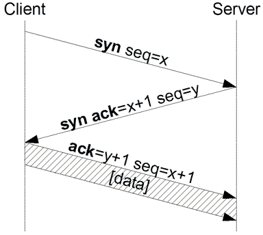
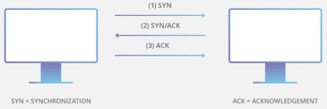
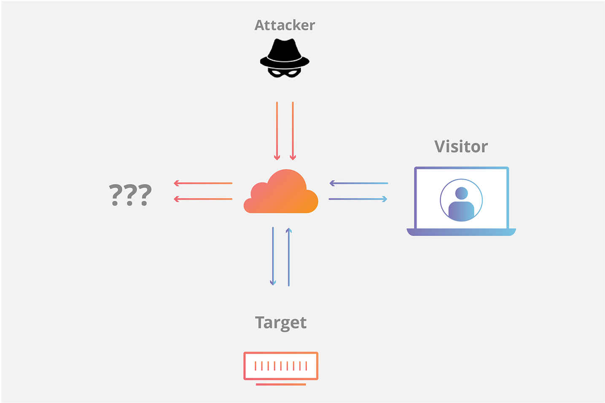

# 	TCP-Syn Flood 

> [!IMPORTANT]
> Como ya se ha comentado, un <b>ataque por inundación SYN (SYN flooding)</b> es un método que el atacante realiza un ataque de denegación de servicio (DoS) a un servidor remoto mediante el envío repetido de <b>paquetes SYN (sincronización)</b> a cada puerto en el servidor, usando direcciones IP falsas, cuyo último resultado es la sobrecarga de información en el sistema, algo que ralentizará las respuestas o, incluso, dejará completamente caído el servidor completo, deteniendo el acceso del tráfico legítimo al mismo.

> ### Funcionamiento de este ataque :globe_with_meridians:
> Veamos un esquema de conexión real:

<p align="center">
<picture>
  <source media="(prefers-color-scheme: dark)" srcset="images/SYNFlood_DDoS_1">
  <source media="(prefers-color-scheme: light)" srcset="images/SYNFlood_DDoS_1.png">
  
</picture>
</p>

> De entre todos los ataques que utilizan la saturación de sistema, SYN flood sigue un patrón de ataque que constituye un abuso del TCP Threeway Handshake.

<p align="center">
<picture>
  <source media="(prefers-color-scheme: dark)" srcset="images/SYNFlood_DDoS_2.png">
  <source media="(prefers-color-scheme: light)" srcset="images/SYNFlood_DDoS_2.png">
  
</picture>
</p>

> Así, como hemos comentado anteriormente, el cliente (atacante) envía un paquete de sincronización (SYN) al servidor, el cual, al recibir este paquete, responde con un paquete de sincronización (SYN) y una confirmación (ACK). La conexión concluye con el acuse de recibo (ACK) por parte del cliente pero, en caso de que esta no se produzca, los sistemas se pueden paralizar, ya que el servidor no cuenta en su memoria con suficientes conexiones confirmadas. 


> ### ¿Cómo detectar un ataque de inundación SYN? :shield:
> La detección como tal puede llegar a ser muy dificil debido a que no se puede distinguir de los picos de tráfico legítimo, y más cuando el posible atacante está enmascarando y ocultando su IP real o si utiliza puertos aleatorios de origen. Así, se pueden utilizar múltiples técnicas que permiten identificar este tipo de ataques:

> - <b>Monitoreo del tráfico de red en busca de actividad sospechosa<b>:Se podrían utilizar herramientas de captura y análisis de paquetes de red (Paessler PRTG Network Monitor, ManageEngine Netflow Analyzer, Scrutinizer, NetflowAuditor, nTop, Pandora NTA, Wireshark, sflowtool, Nfsen, Intermapper Flows, FlowViewer o ManageEngine Flow Analyzer)para inspeccionar el tráfico entrante y saliente del server en búsqued de anomalías como pueden ser niveles inusualmente altos de tráfico, tráfico proveniente de ubicaciones o fuentes poco comunes o un gran número de paquetes SYN sin paquetes ACK correspondientes. 

> - Verificar el estado de los recursos del server</b>: Se podrían utilizar comandos como <b>netstat</b>, <b>ss</b> o <b>iptraf</b> para verificar el estado de las conexiones TCP y comprobar si hay muchas conexiones tipo <b>SYN_RECV</b> o solicitudes de conexión <b>SYN_SENT</b> que no se completan.  Así, se podría utilizar alguno de los siguientes comandos en el shell: 
<b>

```
# mostrar las conexiones TCP en estado <b>SYN_RECV</b>
netstat -ant | grep SYN_RECV
```
</b>

<b>

```
# muestra de estadísticas: 
# - número de aperturas TCP activas
# - aperturas TCP pasivas - paquetes SYN recibidos, 
# - intentos de conexión fallidos de los paquetes SYN-ACK enviados, pero no ACK recibidos 
# - conexiones reiniciadas por los paquetes RST enviados o recibidos 

netstat -s
```
</b>

> - <b>Comprobación de uso de CPU</b>: donde se podría comprobar parámetros como el consumo de memoria, ancho de banda de la red del servidor y otros tantos. 

> - <b>Utilizar SYN COOKIES u otros mecanismos de protección contra inundaciones SYN</b>: Las <b>SYN COOKIES</b> son una técnica que permite al servidor manejar paquetes SYN sin asignar recursos hasta que se reciba el paquete ACK final de manera que, como podríamos comprobar, el servidor puede evitar mantener conexiones medio abiertas y desperdiciar recursos. Para su activación, se pueden utilizar los siguientes comandos en el sistema operativo Linux:
<b>

```
# activar las syn cookies 
sysctl -w net.ipv4.tcp_syncookies="1"
```
</b>

<b>

```
# aumentar el 'backlog queue' 
sysctl -w net.ipv4.tcp_max_syn_backlog="2048"
```
</b>

<b>

```
# minimizar el tiempo de espera en la respuesta al SYN+ACK
sysctl -w net.ipv4.tcp_synack_retries=2
```
</b>

En el caso de Windows: 

<b>

```
# activar la prote4cción anti SYNFlood
C:\>reg add HKLM\SYSTEM\CurrentControlSet\Services\Tcpip\Parameters /v SynAttackProtect /t REG_DWORD /d 1
```
</b>

<b>

```
# aumentar el 'backlog queue' 
C:\>reg add HKLM\System\CurrentControlSet\Services\AFD\Parameters /v EnableDynamicBacklog /t REG_DWORD /d 1

C:\>reg add HKLM\System\CurrentControlSet\Services\AFD\Parameters /v MinimumDynamicBacklog /t REG_DWORD /d 20

C:\>reg add HKLM\System\CurrentControlSet\Services\AFD\Parameters /v MaximumDynamicBacklog /t REG_DWORD /d 20000

C:\>reg add HKLM\System\CurrentControlSet\Services\AFD\Parameters /v DynamicBacklogGrowthDelta /t REG_DWORD /d 10
```
</b>

<b>

```
# minimizar el tiempo de conexión half-open
C:\>reg add HKLM\SYSTEM\CurrentControlSet\Services\Tcpip\Parameters /v TcpMaxConnectResponseRetransmissions /t REG_DWORD /d 2
```
</b>


> - <b>Otros mecanismos de protección</b>: Se incluyen firewalls, balanceadores de carga, proxies o servicios de mitigación de DDoS que pueden filtrar el tráfico malicioso y bloquear paquetes SYN provenientes de direcciones IP enmascaradas.

> - <b>Limitación de velocidad</b>: Consiste en limitar el número de peticiones SYN que pueden enviarse a su servidor en un momento dado, lo que evita en gran medida que el server se vea desbordado, preservando algunos recursos para el tráfico legítimo.

> - <b>Firewall de Aplicaciones Web de Nueva Generación (NGWAF)</b>: <b>NGWAF</b> es un dispositivo o servicio que puede proteger las aplicaciones web de varios tipos de ciberataques, incluidos los ataques SYN Flood ya que se encarga de analizar y filtrar el tráfico entrante en la capa de aplicación y bloquear las peticiones maliciosas antes de que lleguen al servidor. 

> - <b>Segmentación de red</b>: Esta técnica consiste en dividir su red en subredes más pequeñas y seguras para limitar el daño potencial de un ataque de inundación SYN, de manera que se aislan los servidores o aplicaciones críticas del resto de la red, aunque se deben proteger con medidas de seguridad adicionales.

> - <b>Equilibrio de la carga</b>: Consiste en distribuir el tráfico entrante entre varios servidores, reduciendo así el riesgo de que un solo servidor se vea sobrecargado por un ataque de inundación SYN gracias a dispositivos o servicios de balanceo de carga que pueden equilibrar la carga entre los servidores y redirigir el tráfico lejos de los afectados.

> - <b>Aumentar la cola de registros</b>: Conocida como <b>backlog máximo</b>, lo que puede garantizar espacio para el tráfico de usuarios legítimos en medio de un ataque.

> - <b>Reciclaje de la conexión TCP</b>: Que pretende sobrescribir la conexión medio abierta más antigua una vez se haya completado el backlog, con el fin de establecer conexiones con usuarios legítimos en un tiempo menor del que necesitaría el backlog para llenarse de paquetes SYN.

<p align="center">
<picture>
  <source media="(prefers-color-scheme: dark)" srcset="images/SYNFlood_DDoS_3.png">
  <source media="(prefers-color-scheme: light)" srcset="images/SYNFlood_DDoS_3.png">
  
</picture>
</p>

> - <b>Mantener el sistema actualizado y parcheado</b>: Es obligatorio mantener el sistema operativo, software de servidor, aplicaciones y herramientas de seguridad actualizados y parcheados con las últimas versiones y correcciones. 

> - <b>Utilizar autenticación y cifrado seguros</b>: Se deben utilizar métodos de autenticación y cifrado fuertes para proteger el server y sitio web de accesos no autorizados o manipulaciones (usar HTTPS en lugar de HTTP, certificados SSL/TLS en lugar de certificados autofirmados y autenticación de dos factores en lugar de contraseñas).

> - <b>Aplicar políticas y normas de seguridad de la red</b>: Se deben implementar políticas y reglas de seguridad de red que ayuden a controlar y supervisar el tráfico que entrante y saliente del server y sitio web, como por ejemplo utilizar cortafuegos, enrutadores o conmutadores para filtrar el tráfico no deseado o malicioso o, incluso, utilizar dispositivos o servicios IDS o IPS para detectar y bloquear posibles ataques de inundación SYN u otros tipos de ciberataques.

<p align="center">
<picture>
  <source media="(prefers-color-scheme: dark)" srcset="images/SYNFlood_DDoS_4.png">
  <source media="(prefers-color-scheme: light)" srcset="images/SYNFlood_DDoS_4.png">
  
</picture>
</p>