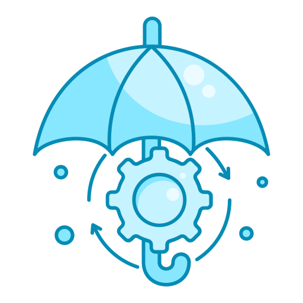

<picture>
  <source media="(prefers-color-scheme: dark)" srcset="images/mitigacion.png">
  <source media="(prefers-color-scheme: light)" srcset="images/mitigacion.png">
  
</picture>

# :desktop_computer:	Mitigación de ataques Web / App

> [!WARNING]
> Laboratorios preparados para el aprendizaje de herramientas, medidas y técnicas diseñadas para reducir el impacto de los ataques dirigidos a aplicaciones web y servicios en línea, como pueden ser:
> - SQLi 
> - Cross-Site Scripting (XSS) 
> - Denegación de servicio (DoS) 
> - Denegación de servicio Distribuída (DDoS) 
> - otros métodos de explotación de vulnerabilidades en aplicaciones web/servicio

> Además de la identificación de posibles puntos débiles en una aplicación web o servicio, se deberán tomar medidas proactivas para proteger este tipo de activos, lo que incluye involucrar sistemas preparados para este tipo de ataques como puede ser la instalación y configuración de firewalls de aplicaciones web (WAF), sistemas de detección de intrusiones (IDS), sistemas de prevención de intrusiones (IPS) y otras soluciones de seguridad para monitorear y filtrar el tráfico web entrante y saliente como los SIEM.

 
 

#  Accede a los laboratorios  :floppy_disk:

- [SYNFlood_DDoS](SYNFlood_DDoS): - Mitigación de ataques DoS y DDoS: TCP SYN Flood