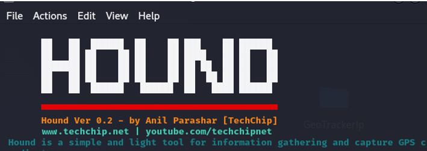
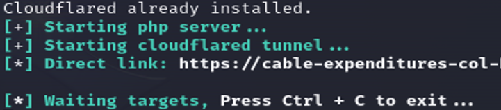
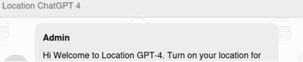
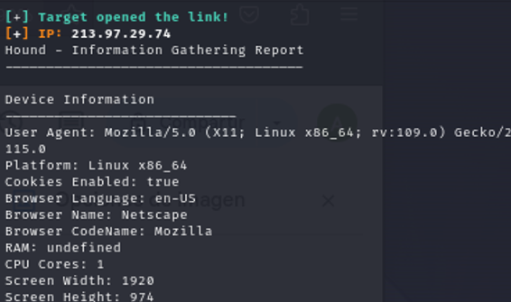
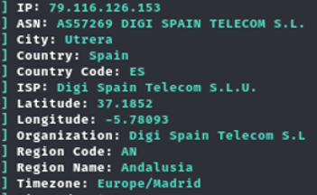

# 	Ataque Ingeniería Social utilizando Hound y Geotracker-IP


> [!IMPORTANT]
> Laboratorio Ingeniería Social realizado en la distro Kali Linux 2023.4, gracias a la instalación de repositorios y otras herramientas. 
Un ataque de <b>ingeniería social</b> es una técnica de manipulación (psicológica) que los ciberatacantes utilizan para engañar a los usuariosy lograr que revelen información confidencial, realicen acciones inseguras o les den acceso a sistemas restringidos.

> Dentro de los ataques de ingeniería social, existen diferentes tipos, los cuales van desde el <b>Phishing</b>	(se reciben correos o mensajes falsos que parecen legítimos y piden hacer clic en enlaces maliciosos), el <b>Vishing</b> (llamadas telefónicas donde el atacante se hace pasar por soporte técnico o personal del banco), el <b>Smishing</b> (se reciben mensajes SMS engañosos con enlaces o instrucciones falsas), el <b>Pretexting</b> (donde el atacante inventa una historia/pretexto para obtener datos, como un falso auditor o reclutador), el <b>Baiting</b> (un clásico que ofrece algo atractivo como descargas gratis, USB olvidado para que la víctima lo use y active malware) o el <b>Tailgating</b>	(en esta caso un atacante entra físicamente a un edificio aprovechando que alguien le abre la puerta sin preguntar).

> ### Primeros pasos: Instalación HOUND :computer:
> En primer lugar, debemos llegar hasta el repo de Github de <b>Hound</b>: https://github.com/techchipnet/hound. Posteriormente, clonamos el repositorio en nuestro sistema (carpeta de sistema /OPT). Para realizar estas tareas es más seguro realizarlo con el usuario administrador:

```
git clone https://github.com/techchipnet/hound
```
```
cd hound
```
```
bash hound.sh
```
Después de realizar los pasos anteriores, aparecerá la pantalla adjunta

<p align="center">
<picture>
  <source media="(prefers-color-scheme: dark)" srcset="images/hound.png">
  <source media="(prefers-color-scheme: light)" srcset="images/hound.png">
  
</picture>
</p>

> ### Trabajando con Hound :computer:
> Al ser un phishing, debemos tener en cuenta muchos factores, aunque el factor principal es la posible detección de nuestra campaña de phishing, por lo que, para evitar posibles detecciones, pulsamos Y en la opción de <b>Cloudflare</b>. 
> Se cargará todos los parámetros necesarios hasta proporcionarnos un enlace: https://cable-expenditures-col-hardware.trycloudflare.com.

<p align="center">
<picture>
  <source media="(prefers-color-scheme: dark)" srcset="images/hound2.png">
  <source media="(prefers-color-scheme: light)" srcset="images/hound2.png">
  
</picture>
</p>

> El usuario podría acceder al link, pero lo que realmente mostrará es un simple chat... 

<p align="center">
<picture>
  <source media="(prefers-color-scheme: dark)" srcset="images/hound3.png">
  <source media="(prefers-color-scheme: light)" srcset="images/hound3.png">
  
</picture>
</p>

> Ahora bien, cuando la víctima comience a interactuar con el enlace, en el terminal de nuestro sistema aparecerán los siguientes datos:

<p align="center">
<picture>
  <source media="(prefers-color-scheme: dark)" srcset="images/hound4.png">
  <source media="(prefers-color-scheme: light)" srcset="images/hound4.png">
  
</picture>
</p>

> ### Continuando: Instalación Geotracker IP :computer:
> Accedemos al repositorio de <b>GeoTrackerIP</b>: https://github.com/jric2002/GeoTrackerIP. Posteriormente, clonamos el repositorio en nuestro sistema (carpeta de sistema /OPT). DE nuevo, para realizar estas tareas es más seguro realizarlo con el usuario administrador:
 
```
git clone https://github.com/jric2002/GeoTrackerIP
```
```
cd GeoTrackerIP
```
```
chmod +x GeoTrackerIP.py
```
```
chmod +x install.py
```
```
python3 install.py
```
> Después de realizar los pasos anteriores, nos ponemos "manos a la obra" y arrancamos la aplicación:  

```
python3 GeoTrackerIP.py 
```

> De la dirección ip y dominio que nos ha proporcionado Hound, se la copiamos e introducimos a esta nueva aplicación: 

```
python3 GeoTrackerIP.py -t https://example.com
```

> Es muy posible que la geolocalización no sea exacta, ya que se depende de la compañía, pero sí proporcionará otra información como sistema operativo y otros tantos datos de interés.

<p align="center">
<picture>
  <source media="(prefers-color-scheme: dark)" srcset="images/geo.png">
  <source media="(prefers-color-scheme: light)" srcset="images/geo.png">
  
</picture>
</p>