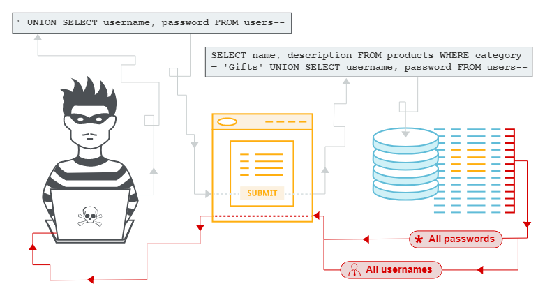

<picture>
  <source media="(prefers-color-scheme: dark)" srcset="images/inyeccion-sql.png">
  <source media="(prefers-color-scheme: light)" srcset="images/inyeccion-sql.png">
  
</picture>

# :syringe:	SQLi: Structured Query Language Injection

> [!CAUTION]
> Laboratorios preparados para la realización de <b>ataques SQLi (SQL Injection)</b> (Kali Linux 2023.4). Este laboratorio trata de realizar un ataque de inyección de código en el lado servidor, es decir, inyectar código malicioso a la hora de realizar una consulta que se envía a una base de datos a través de una aplicación web, si bien este tipo de ataque aprovecha las vulnerabilidades de seguridad que están presentes en las aplicaciones que interactúan con bases de datos de tipo SQL, como pueden ser <b>MySQL</b>, <b>PostgreSQL</b>, <b>Microsoft SQL Server</b>, <b>Oracle Database</b> y <b>SQLite</b>, por ejemplo. 

## SQLi... ¿No es un problema del DBA (DataBase Administrator)?
Como estamos comentando, el objetivo principal de un <b>ataque de inyección SQL</b> es manipular la consulta SQL original de manera que se ejecuten "acciones no autorizadas" en la base de datos (extracción de datos confidenciales, modificación de datos o eliminación de información, entre otras muchas).
Ahora bien, la cruda realidad nos demuestra que debemos considerar la responsabilidad de desarrolladores y DBA en los posibles ataques de este tipo ya que:

- Desarrolladores de software: Tienen la responsabilidad de escribir código seguro y resistente a los ataques de inyección SQL, lo que implica implementar prácticas de codificación segura (uso de consultas parametrizadas, uso del filtrado y validación adecuados de las entradas de usuario, manejo de expresiones regulares o RegExp...)

- Administradores de sistemas: Deben mantener actualizados los sistemas y aplicaciones e implementar medidas de seguridad en capas (firewalls, IDS/IPS o SIEM) para prevenir y detectar posibles ataques.

- Usuarios finales: Aunque su responsabilidad es <b>indirecta</b>, los usuarios finales deberían adoptar buenas prácticas de seguridad, como usar contraseñas seguras (en longitud y tipo), además de estar alerta ante posibles signos de actividad maliciosa en sitios web o aplicaciones.

<picture>
  <source media="(prefers-color-scheme: dark)" srcset="images/inyeccion-sql_1.png">
  <source media="(prefers-color-scheme: light)" srcset="images/inyeccion-sql_1.png">
  
</picture>

> El funcionamiento consta de las siguientes fases:
  - <b>Identificación de la vulnerabilidad</b>: El atacante examina la aplicación web en busca de campos de entrada que puedan estar conectados a una base de datos y que puedan ser vulnerables a la inyección SQL, los cuales pueden ser cualquiera de los campos que tenemos disponibles en websites y aplicaciones web, como formularios de búsqueda, campos de inicio de sesión, parámetros de URL, entre otros.
  
  - <b>Inserción de código malicioso</b>: Una vez es identificado un campo vulnerable, el atacante introduce código SQL malicioso en dicho campo, lo que incluye fragmentos de código SQL diseñados para alterar el comportamiento de las consultas a la base de datos.

  - <b>Ejecución del ataque</b>: Cuando el servidor web procesa la solicitud del atacante, la aplicación web toma el código SQL malicioso introducido en el campo vulnerable y lo ejecuta directamente en la base de datos sin una adecuada validación o filtrado.... ¡¡Es el momento de la verdad!!
  
  - <b>Manipulación de la base de datos</b>: Dependiendo de la naturaleza del código SQL malicioso utilizado, el resultado del ataque puede variar desde permitir al atacante extraer información confidencial de la base de datos, modificar o eliminar datos, o incluso tomar el control total del sistema...
  
  - <b>Exfiltración de datos</b>: Después de realizar el ataque de inyección SQL con éxito, el atacante puede <b>exfiltrar</b> los datos obtenidos de la base de datos a través de la misma aplicación web o de otros métodos (descarga de archivos o visualización de información en pantalla). En este momento, cualquier herramienta es válida para conseguir la información deseada.

#  Antes de todo... 

> [!IMPORTANT]
> Antes de comenzar a enteder cómo funciona SQLi, se necesario seguir una serie de pasos imprescindibles para que el sistema esté completamente preparado para la realización correcta del laboratorio, lo que incluye la instalación de un entorno de trabajo para testear este tipo de ataques.

> ### Pre-requisitos 📋
Paso 1: Instalación de <b>DVWA (Damn Vulnerable Web App)</b>, la aplicación web vulnerable a los tipos de ataques más conocidos que, junto con <b>BadStore</b>, <b>BWAPP</b>(online), <b>Gruyere</b> (online), <b>WSD</b> (online), <b>Metaexplotable 2</b>, <b>OWASP Mutillidae II</b> y <b>OWASP Web Goat</b>, nos permiten testear fallos de seguridad de tipo scripting entre sitios (XSS) y falsificación de solicitudes entre sitios (CSRF), DoS (Ataques de denegación de servicio), Ataques de hombre en el medio (MITM), Falsificación de solicitudes del lado del servidor (SSRF), Inyecciones (SQL, OS Command, HTML, PHP y SMTP, etc), carga de archivos insegura/inclusión de archivos, ejecución de comandos, fuerza bruta, manejo inadecuado de errores, manipulación de parámetros, manipulación de defectos en la gestión de sesiones, comunicación/configuración inserguras, phishing, manipulación de tiempos de ejecución, parcheo binario, aplicación de parches, rotura de la criptografía... 
Aquí tienes disponibles las URL o descargas de estas aplicaciones vulnerables:

- [bWAPP](http://itsecgames.com/): <b>BuggyWeb</b>
- [Gruyere](https://google-gruyere.appspot.com/): <b>Gruyere</b>
- [OWASP WebGoat](https://owasp.org/www-project-webgoat/): <b>OWASP WebGoat</b>

> ### Ejecutando las pruebas previas en busca de información: <b>INFORMATION GATHERING</b> ⚙️

<picture>
  <source media="(prefers-color-scheme: dark)" srcset="images/metasploit_2.png">
  <source media="(prefers-color-scheme: light)" srcset="images/metasploit_2.png">
  
</picture>

 

## :bricks:	CheatSheets de utilidad	:books:
- [CheatSheet](CheatSheet): CheatSheet (hoja de trucos) para <b>Metasploit</b> y <b>Nmap</b>.

 
 

#  Accede a los laboratorios  :floppy_disk:

- [LABORATORIO I](Meterpreter):  - Creación, instalación y manejo de Meterpreter (<b>Metasploit + MSFVenom</b>). 

- [LABORATORIO II](SYNFloodDoS):  - Ataque DoS <b>(Denial Of Service)</b> utilizando <b>SYNFlood</b> (inundación de peticiones al objetivo mediante paquetes SYN).

- [LABORATORIO III](HTTPFloodDoS):  - Ataque DoS <b>(Denial Of Service)</b> utilizando <b>HTTPlood</b> (inundación de peticiones al objetivo mediante peticiones GET o POST del cliente).