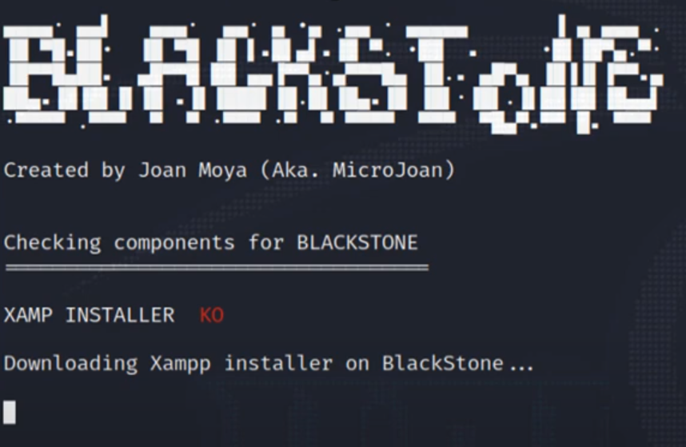

# 	BlackStone Project 

> [!IMPORTANT]
> Laboratorio BlackStone Project (Kali Linux 2023.4). El proyecto es una herramienta creada con el fin de automatizar el trabajo de redacción y presentación de un informe de auditorías de hacking ético o pentesting, donde podemos registrar (en una base de datos propia) las vulnerabilidades encontradas en la auditoría, clasificándolas por internas, externas o WiFi, colocar la descripción y recomendación de las mismas, así como el nivel de severidad y el esfuerzo para su corrección. Esta información ayudará a generar en el informe una tabla de criticidad como resumen global de las vulnerabilidades encontradas, además de incluir información adicional como página web, subdominios, números de teléfono, redes sociales, correos electrónicos de los empleados…

> ### Trabajando con TorGhost: Instalación y configuración :computer:
> TorGhost tiene las siguientes características:
> - Redirección de todo el tráfico de red hacía la red TOR, es decir, cualquier conexión del equipo que intente conectarse a Internet pasará por ella.
> - No se filtrará ningún ping, lo que protege nuestra identidad.
> - Fuerza a las aplicaciones a pasar por ella (al contrario que ProxyChain). 
> - Rechaza peticiones entrantes y salientes que puedan contener información sensible o pueda revelar nuestra IP real.
> - Protege de la fuga de DNS, permitiendo usar un DNS remoto anónimo.

- <b>Paso 0</b>: Accedemos a la carpeta <b>OPT</b> del sistema operativo de Kali, proporcionando una ubicación donde instalar aplicaciones opcionales (de 3º):
<b>

```
cd /opt
```
</b>

- <b>Paso 1</b>: Se deberá clonar el repositorio en el equipo, para cual se codifica:
<b>

```
git clone https://github.com/micro-joan/BlackStone
```
</b>

- <b>Paso 2</b>: Ahora, se procede entrar en la carpeta del sistema en la que se ha descargado BlackStone. Una vez dentro de la correspondiente carpeta, se dan los permisos de ejecución al archivo de instalación mediante el siguiente código:
<b>

```
chmod +x installer.sh
```
</b>

Se instalará el paquete completo en el sistema gracias al siguiente código:
<b>

```
./installer.sh
```
</b>

Es posible que no funcione la construcción del archivo sh. En este caso, la aplicación se iniciará automáticamente pero si se inicia la sesión, se obtendrá <b>error 500</b>, momento en el que es necesario reiniciar el sistema y ejecutar el instalador por segunda vez.
<b>

```
#(rebooteo el sistema)

cd /opt/blackstone

./installer.sh
```
</b>


- <b>Paso 3</b>: Antes de instalar la aplicación como tal, se instalará la versión para Linux de XAMPP. En este momento, aparecerá una pantalla similar a la siguiente imagen:
<picture>
  <source media="(prefers-color-scheme: dark)" srcset="bstone_1.png">
  <source media="(prefers-color-scheme: light)" srcset="bstone_1.png">
  
</picture>

- <b>Paso 4</b>: Para iniciar la redirección de todo el tráfico por la red TOR, utilizamos el siguiente comando:
<b>

```
python3 torghost.py -s
```
</b>

El script cargará y aparecerán los correspondientes mensajes de inicio de forzado, cambios de DNS y toda la carga para obtener un resultado óptimo, es decir, CURRENT IP: la nueva IP

<picture>
  <source media="(prefers-color-scheme: dark)" srcset="torghost_2.png">
  <source media="(prefers-color-scheme: light)" srcset="torghost_2.png">
  
</picture>


- <b>Paso 5</b>: Posteriomente, se comprobará la dirección IP pública de la misma forma que hemos hecho la primera comprobación, ara lo cual se utilizará el navegador de Kali Linux (Mozilla Firefox), donde se introducirá la URL: 
<b>

```
https://www.cualesmiip.com/
```
</b>

Es posible que el cambio de IP motive la falta de carga de algunos sites... ¡¡Ya estamos en la red TOR!!

Para detener el script:
<b>
```
python3 torghost.py -x
```
</b>


Para cambiar el nodo de salida:
<b>
```
python3 torghost.py -r
```
</b>

> A partir de este momento, todo nuestro tráfico estará redirigido a través de la red TOR.