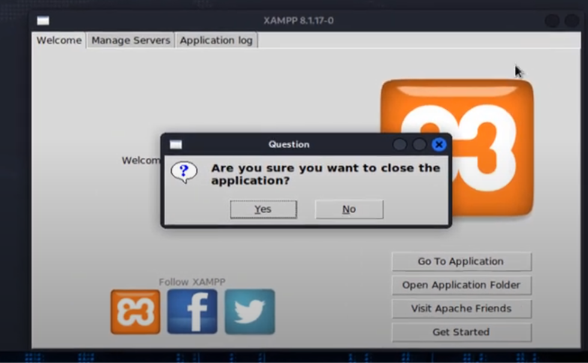

# 	BlackStone Project 

> [!IMPORTANT]
> Laboratorio BlackStone Project (Kali Linux 2023.4). El proyecto es una herramienta creada con el fin de automatizar el trabajo de redacción y presentación de un informe de auditorías de hacking ético o pentesting, donde podemos registrar (en una base de datos propia) las vulnerabilidades encontradas en la auditoría, clasificándolas por internas, externas o WiFi, colocar la descripción y recomendación de las mismas, así como el nivel de severidad y el esfuerzo para su corrección. Esta información ayudará a generar en el informe una tabla de criticidad como resumen global de las vulnerabilidades encontradas, además de incluir información adicional como página web, subdominios, números de teléfono, redes sociales, correos electrónicos de los empleados…

> ### Trabajando con TorGhost: Instalación y configuración :computer:
> TorGhost tiene las siguientes características:
> - Redirección de todo el tráfico de red hacía la red TOR, es decir, cualquier conexión del equipo que intente conectarse a Internet pasará por ella.
> - No se filtrará ningún ping, lo que protege nuestra identidad.
> - Fuerza a las aplicaciones a pasar por ella (al contrario que ProxyChain). 
> - Rechaza peticiones entrantes y salientes que puedan contener información sensible o pueda revelar nuestra IP real.
> - Protege de la fuga de DNS, permitiendo usar un DNS remoto anónimo.

- <b>Paso 0</b>: Accedemos a la carpeta <b>OPT</b> del sistema operativo de Kali, proporcionando una ubicación donde instalar aplicaciones opcionales (de 3º):
<b>

```
cd /opt
```
</b>

- <b>Paso 1</b>: Se deberá clonar el repositorio en el equipo, para cual se codifica:
<b>

```
git clone https://github.com/micro-joan/BlackStone
```
</b>

- <b>Paso 2</b>: Ahora, se procede entrar en la carpeta del sistema en la que se ha descargado BlackStone. Una vez dentro de la correspondiente carpeta, se dan los permisos de ejecución al archivo de instalación mediante el siguiente código:
<b>

```
chmod +x installer.sh
```
</b>

Se instalará el paquete completo en el sistema gracias al siguiente código:
<b>

```
./installer.sh
```
</b>

Es posible que no funcione la construcción del archivo sh. En este caso, la aplicación se iniciará automáticamente pero si se inicia la sesión, se obtendrá <b>error 500</b>, momento en el que es necesario reiniciar el sistema y ejecutar el instalador por segunda vez.
<b>

```
#(rebooteo el sistema)

cd /opt/blackstone

./installer.sh
```
</b>


- <b>Paso 3</b>: Antes de instalar la aplicación como tal, se instalará la versión para Linux de XAMPP. En este momento, aparecerán las siguientes pantallas, similares a la siguientes imágenes:
<p align="center">
<picture>
  <source media="(prefers-color-scheme: dark)" srcset="bstone_1.png">
  <source media="(prefers-color-scheme: light)" srcset="bstone_1.png">
  
</picture>

<picture>
  <source media="(prefers-color-scheme: dark)" srcset="bstone_2.png">
  <source media="(prefers-color-scheme: light)" srcset="bstone_2.png">
  
</picture>

<picture>
  <source media="(prefers-color-scheme: dark)" srcset="bstone_3.png">
  <source media="(prefers-color-scheme: light)" srcset="bstone_3.png">
  
</picture>
</p>

- <b>Paso 4</b>: Después de la instalación completa de XAMPP, la aplicación arrancará automáticamente, mostrando la pantalla de login. En esta pantalla podremos seleccionar el idioma en el que queremos que abra esta aplicación (inglés o español)

<p align="center">
<picture>
  <source media="(prefers-color-scheme: dark)" srcset="bstone_4.png">
  <source media="(prefers-color-scheme: light)" srcset="bstone_4.png">
  
</picture>
</p>

> A partir de este momento, se podrá utilizar la aplicación normalmente. Para su uso, podremos introducir diferentes parámetros (información de la empresa, cliente...), tal y como podemos comprobar en la siguiente imagen:

<p align="center">
<picture>
  <source media="(prefers-color-scheme: dark)" srcset="bstone_5.png">
  <source media="(prefers-color-scheme: light)" srcset="bstone_5.png">
  
</picture>
</p>

> Se podrán realizar las siguientes acciones:

- En la configuración del perfil, cambiaremos la contraseña
- En la opción <b>Cliente registrados</b>, se puede ir añadiendo los datos que correspondan, como el nombre, redes sociales, correo electrónico y número de teléfono del propietario de la empresa, (comprobar que la contraseña expuesta en la web profunda), añadir subdominios de la web así como información de interés encontrada en Google y, por supuesto, añadir los correos electrónicos de los trabajadores de la empresa.
- En la opción <b>Informe</b> se creará un informe y se añadirá la empresa a auditar, además de añadir las posibles vulnerabilidades que se han encontrado en los sistemas. La generación del informe se podrá realizar en diversos 


