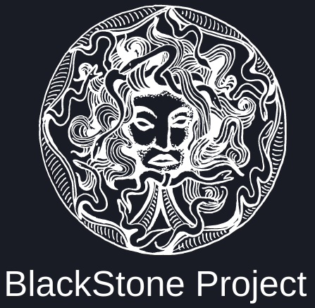

<p align="center">
<picture>
  <source media="(prefers-color-scheme: dark)" srcset="vuln.png">
  <source media="(prefers-color-scheme: light)" srcset="vuln.png">
  
</picture>
</p>

# :desktop_computer:	BlackStone Project 2.0 

<p align="center">
<picture>
  <source media="(prefers-color-scheme: dark)" srcset="black.png">
  <source media="(prefers-color-scheme: light)" srcset="black.png">
  
</picture>
</p>

> [!CAUTION]
> Laboratorios preparados para escaneo de vulnerabilidades y la realización del posterior informe (Kali Linux 2023.4). En este laboratorio se aprender a utilizar la herramienta del proyecto BlackStone o <b>BlackStone Project</b>, herramienta creada con el objetivo de automatizar el trabajo de redacción y envío de un informe sobre auditorías de hacking ético o pentesting donde se puede registrar, incluyendo su página web, subdominios, números de teléfono, redes sociales, correos electrónicos de los empleados… Podremos, en resumen, tener un informe completo de:

- vulnerabilidades encontradas
- clasificación por auditoría interna, externa o wifi
- añadir tipo de vulnerabilidad, descripción y recomendación, así como el nivel de gravedad y esfuerzo para su corrección 


> ¿Pero porqué utilizar este tipo de herramientas?
La realización de un informe final de vulnerabilidades es un verdadero y auténtico caos si no se cuidan las herramientas con las que se están realizando estos escaneos... Debemos tener en cuenta que cada una de ellas genera un reporte que, al final, tendrá que ser resumido, explicado y filtrado debido a que, en la mayor parte de los casos, se listan cantidades muy grandes de información. Gracias a aplicaciones de este tipo, toda la información nos ayudará a generar en el informe una tabla de criticidad como resumen global de las vulnerabilidades encontradas en nuestros clientes.

<br>
<br>

#  Antes de todo... 

> [!IMPORTANT]
> Antes de navegar por la Deep Web o utilizar cualquier tipo de herramienta que necesite de una conexión con el exterior, es necesario seguir una serie de pasos imprescindibles para que el sistema esté completamente preparado para la realización correcta del laboratorio.

> ### Pre-requisitos 📋
Paso 1: Comprobación de la IP pública del nuestro propio sistema, para lo cual se utilizará el navegador de Kali Linux (Mozilla Firefox), donde se introducirá la URL: 
<b>
```
https://www.cual-es-mi-ip.net/
```
</b>

<p align="center">
<picture>
  <source media="(prefers-color-scheme: dark)" srcset="torghost_1.png">
  <source media="(prefers-color-scheme: light)" srcset="torghost_1.png">
  
</picture>
<picture>
  <source media="(prefers-color-scheme: dark)" srcset="torghost_2.png">
  <source media="(prefers-color-scheme: light)" srcset="torghost_2.png">
  
</picture>
</p>

<br>
<br>

#  Accede a los laboratorios  :floppy_disk:

- [LABORATORIO I](TorGhost): - Instalación y configuración del script de anonimización <b>TorGhost</b>