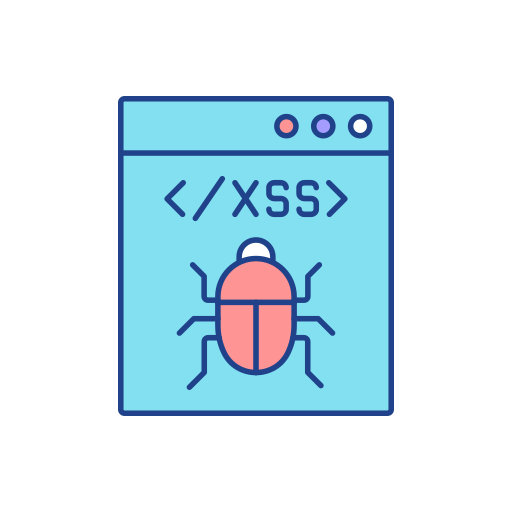
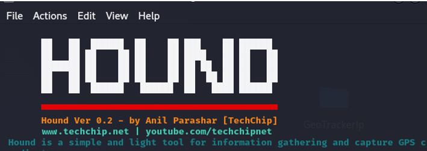
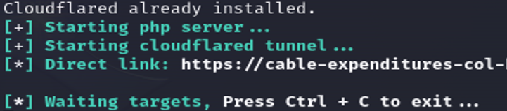
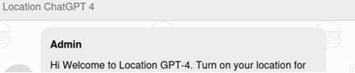
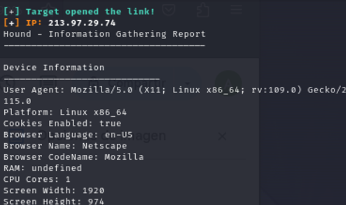
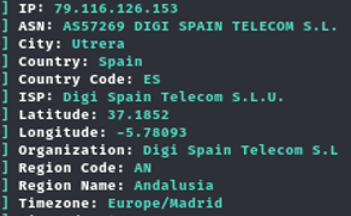

# 	Ataque XSS con evasión de WAFs


> [!IMPORTANT]
> Laboratorio ataque XSS realizado en la distro Kali Linux 2023.4, gracias a la instalación de repositorios y otras herramientas. Un <b>ataque XSS</b> (<b>Cross-Site Scripting</b>) aprovecha un tipo de vulnerabilidad de seguridad en aplicaciones y sistemas web que permite a un atacante inyectar <b>scripts</b> maliciosos (JavaScript) en páginas determinadas muy visitadas por los usuarios ejecutando directamente el código en el propio navegador del usuario final víctima sin su consentimiento.

> Entre los tipos más reconocidos de XSS, podemos encontrar:
- <b>XSS reflejado (Reflected XSS)</b>: El script se envía a través de una solicitud (enlace o formulario) y se refleja directamente en la respuesta de la página.
Ejemplo: https://ejemplo.com/?q=<script>alert(1)</script>
- <b>XSS almacenado (Stored XSS)</b>: El código malicioso se guarda permanentemente en la base de datos de la aplicación y se muestra a los usuarios cada vez que cargan una página. Este tipo de códigos los podemos insertar en áreas muy determinadas como comentarios, foros, perfiles de usuario, etc.
- <b>XSS basado en DOM (DOM-based XSS)</b>: este ataque se produce cuando el navegador procesa contenido dinámico mediante JavaScript sin validación adecuada, manipulando directamente el DOM.

> Hecha la ley, hecha la trampa… Como sabemos desde hace tiempo, los sitios web están muy protegidos contra ataques de tipo inyección de código gracias a entornos e infraestructuras que proporcionan empresas como Cloudflare, Imperva y muchos más. La cuestión es que, como es común, un atacante va a <b>APROVECHAR NUESTROS FALLOS PARA ENTRAR EN EL SISTEMA, DONDE TAMBIÉN INCLUIMOS NUESTRA PEREZA POR PROGRAMAR DE FORMA SEGURA</b>.
> Técnicas tan sencillas como revisar lo que introduce el usuario, sanitizar código y muchas cosas más no se realizan por cientos de motivos diferentes (aunque principalmente suele ser el económico). Por tanto, y como podremos imaginar, existe múltiples técnicas utilizadas para evadir los cortafuegos de aplicaciones web (WAF) durante ataques de Cross-Site Scripting (XSS). Veamos qué significado tiene cada cosa y cómo podemos trabajar para mitigar este tipo de inyecciones.
<b>WAF = Web Application Firewall → Cortafuegos de aplicaciones web</b>

> Un <b>WAF</b> se pone entre el usuario y el servidor (o API) para inspeccionar el tráfico HTTP/HTTPS y poder detectar y/bloquear bloquear ataques dirigidos contra aplicaciones web. Pero… ¿De qué nos protege realmente un WAF? La respuesta es muy sencilla:


> ### Primeros pasos: Instalación HOUND :computer:
> En primer lugar, debemos llegar hasta el repo de Github de <b>Hound</b>: https://github.com/techchipnet/hound. Posteriormente, clonamos el repositorio en nuestro sistema (carpeta de sistema /OPT). Para realizar estas tareas es más seguro realizarlo con el usuario administrador:

```
git clone https://github.com/techchipnet/hound
```
```
cd hound
```
```
bash hound.sh
```
Después de realizar los pasos anteriores, aparecerá la pantalla adjunta

<p align="center">
<picture>
  <source media="(prefers-color-scheme: dark)" srcset="images/hound.png">
  <source media="(prefers-color-scheme: light)" srcset="images/hound.png">
  
</picture>
</p>

> ### Trabajando con Hound :computer:
> Al ser un phishing, debemos tener en cuenta muchos factores, aunque el factor principal es la posible detección de nuestra campaña de phishing, por lo que, para evitar posibles detecciones, pulsamos Y en la opción de <b>Cloudflare</b>. 
> Se cargará todos los parámetros necesarios hasta proporcionarnos un enlace: https://cable-expenditures-col-hardware.trycloudflare.com.

<p align="center">
<picture>
  <source media="(prefers-color-scheme: dark)" srcset="images/hound2.png">
  <source media="(prefers-color-scheme: light)" srcset="images/hound2.png">
  
</picture>
</p>

> El usuario podría acceder al link, pero lo que realmente mostrará es un simple chat... 

<p align="center">
<picture>
  <source media="(prefers-color-scheme: dark)" srcset="images/hound3.png">
  <source media="(prefers-color-scheme: light)" srcset="images/hound3.png">
  
</picture>
</p>

> Ahora bien, cuando la víctima comience a interactuar con el enlace, en el terminal de nuestro sistema aparecerán los siguientes datos:

<p align="center">
<picture>
  <source media="(prefers-color-scheme: dark)" srcset="images/hound4.png">
  <source media="(prefers-color-scheme: light)" srcset="images/hound4.png">
  
</picture>
</p>

> ### Continuando: Instalación Geotracker IP :computer:
> Accedemos al repositorio de <b>GeoTrackerIP</b>: https://github.com/jric2002/GeoTrackerIP. Posteriormente, clonamos el repositorio en nuestro sistema (carpeta de sistema /OPT). DE nuevo, para realizar estas tareas es más seguro realizarlo con el usuario administrador:
 
```
git clone https://github.com/jric2002/GeoTrackerIP
```
```
cd GeoTrackerIP
```
```
chmod +x GeoTrackerIP.py
```
```
chmod +x install.py
```
```
python3 install.py
```
> Después de realizar los pasos anteriores, nos ponemos "manos a la obra" y arrancamos la aplicación:  

```
python3 GeoTrackerIP.py 
```

> De la dirección ip y dominio que nos ha proporcionado Hound, se la copiamos e introducimos a esta nueva aplicación: 

```
python3 GeoTrackerIP.py -t https://example.com
```

> Es muy posible que la geolocalización no sea exacta, ya que se depende de la compañía, pero sí proporcionará otra información como sistema operativo y otros tantos datos de interés.

<p align="center">
<picture>
  <source media="(prefers-color-scheme: dark)" srcset="images/geo.png">
  <source media="(prefers-color-scheme: light)" srcset="images/geo.png">
  
</picture>
</p>